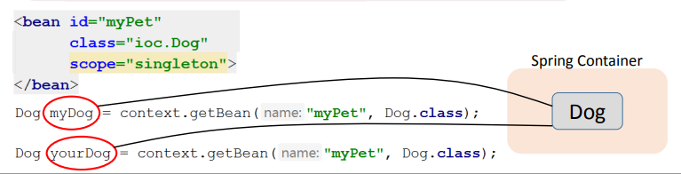
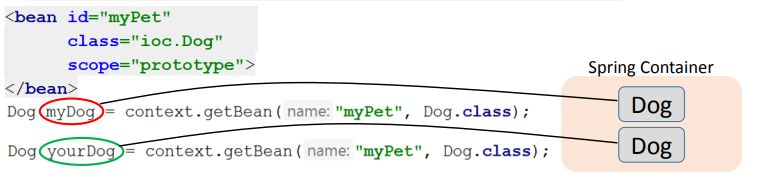

<h1>
    Scope 
</h1>

**Scope (область видимости)** определяет:

- жизненный цикл бина
- возможное количество создаваемых бинов

<h5>
    Разновидности Bean Scope
</h5>

В **Spring** определены следующие области видимости:

- Singleton
- Prototype
- Request
- Session
- Global-session

При выполнении ЛР вас интересуют **Singleton** и **Prototype**.

<h3 align="center">
    Singleton
</h3>

**Singleton** – дефолтный scope в Spring.

- такой бин создаётся сразу после прочтения Spring Container-ом конфиг файла.
- является общим для всех, кто запросит его у Spring Container-а.

Подробнее:

- **Eager-инициализация** — бин создаётся сразу при загрузке контейнера, ещё до вызова `getBean()`.
- **Один экземпляр** — все вызовы `getBean()` возвращают одну и ту же ссылку (`==` вернёт `true`).
- **Общее состояние** — изменение поля бина через одну ссылку видно через все остальные, поскольку это один и тот же объект.
- **Полное управление жизненным циклом** — Spring управляет init и destroy методами. Подробнее: [spring6_lifeCycle](../spring6_lifeCycle/life_cycle.md).



<h3 align="center">
    Prototype
</h3>

**Prototype**

- такой бин создаётся только после обращения к Spring Container-у с помощью метода getBean.
- для каждого такого обращения создаётся новый бин в Spring Container-е.

Подробнее:

- **Lazy-инициализация** — бин создаётся только при вызове `getBean()`, не при старте контейнера.
- **Независимые экземпляры** — каждый `getBean()` возвращает новый объект, изменение одного не влияет на другие.
- **Неполное управление жизненным циклом** — Spring **НЕ** вызывает destroy-method для prototype бинов. Программист сам отвечает за освобождение ресурсов. Подробнее: [spring6_lifeCycle](../spring6_lifeCycle/life_cycle.md).



<h3 align="center">
    Сравнение Singleton и Prototype
</h3>

| Характеристика | Singleton | Prototype |
|---|---|---|
| По умолчанию | Да | Нет |
| Момент создания | При загрузке контейнера | При вызове `getBean()` |
| Количество экземпляров | Один на контейнер | Новый при каждом запросе |
| `==` при двух `getBean()` | `true` | `false` |
| Вызов destroy-method | Да | Нет |
| Общее состояние | Да | Нет |

<h3 align="center">
    Когда использовать
</h3>

- **Singleton** — stateless сервисы, DAO, конфигурации, утилиты. Большинство бинов в Spring-приложении — синглтоны.
- **Prototype** — когда каждому потребителю нужен свой экземпляр с собственным состоянием.

<h3 align="center">
    Задание Scope
</h3>

Как несложно догадаться Scope можно задать двумя способами, в зависимости от выбранного способа работы с контекстом:
через XML-файл и аннотации.

**Лучшей практикой считается всегда явно прописывать Scope, даже если вам нужен Singleton, который по умолчанию**.

<h5>
    Задание Scope в XML-файле
</h5>

Если мы работаем с контекстом через XML-файл, то при инициализации бина необходимо прописать отдельное свойство Scope.
*Scope по умолчанию - **Singleton***.

```xml

<bean class="spring7_scope.singleton.SingletonPerson" scope="singleton">
    <constructor-arg name="name" value="Petr"/>
    <constructor-arg name="lastname" value="Petrov"/>
    <constructor-arg name="age" value="25"/>
</bean>
```

Пример задания Scope через XML-файл: [singleton](singleton) + ```resources/singletonContext.xml```

<h5>
    Задание Scope через аннотацию
</h5>

Если мы работаем через аннотации, то у классов помеченных аннотацией ```@Component``` необходимо добавить аннотацию
```@Scope``` и внутри нее прописать необходимое значение ```"singleton"``` или ```"prototype"```.

```java

@Component
@Scope("prototype")
public class PrototypeService {
    //
}
```

Пример задания Scope через аннотации [prototype](prototype)