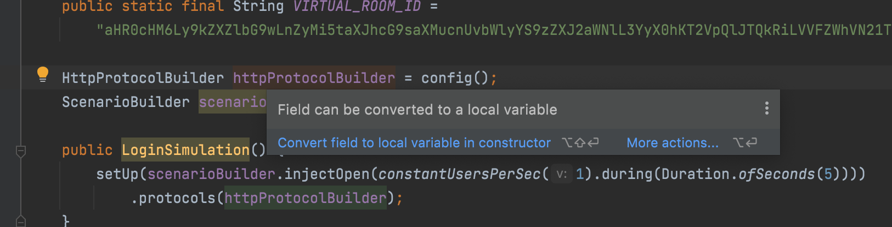

# Правила именования

## Именование аббревиатур в именах классов, полей и методов

Любые аббревиатуры любой длины (2 и более символов) следует писать CamelCase'ом.

**Пример**

```java
//Неправильно
NTLMLDAPHTTPAuth
HTMLColumn
JSONView

//Правильно
NtlmLdapHttpAuth
HtmlColumn
JsonView
```

## Именование констант

Константы всегда должны быть написаны в верхнем регистре. Между словами должен стоять символ подчеркивания.

**Пример**

```java
//Неправильно
protected static final String FIRSTNAME = "firstname";
protected static final String LASTNAME = "lastname";

//Правильно
protected static final String FIRST_NAME = "firstname";
protected static final String LAST_NAME = "lastname";
```

**Пример**

```java
// Неправильно
public static final int INDEX_OF_NEXT_RECURSIVE_PARAM = 1;
public static final int INDEX_BEGIN_PARAM_WITHOUT_RECURSIVE = 1;

// Правильно
public static final int NEXT_RECURSIVE_PARAM_INDEX = 1;
public static final int BEGIN_PARAM_WITHOUT_RECURSIVE_INDEX = 1;
```

> ℹ️ **Зачем это делать**
>
> В Java существует [соглашение](https://www.oracle.com/java/technologies/javase/codeconventions-namingconventions.html)
> об именовании констант. Несмотря на то, что оно необязательное, соблюдение этого правила помогает отличать константы
> от
> обычных переменных, повысить понимание значения константы и читаемости кода, а также привести его к более
> единообразному
> стилю

## Именование в enum

Все элементы enum должны именоваться в PascalCase.

**Пример enum**

```java
enum OrderStatus {
    AwaitingPayment, 
    Processing, 
    Shipped,
    Delivered,
    CancelledByUser
}
```

## Названия переменных и параметров должны отображать их смысловую нагрузку

По названию переменной разработчик должен сразу понимать, какие данные в ней хранятся. Это правило относится ко всем
типам переменных, далее рассмотрены лишь некоторые примеры.

Например, если внутри параметра/переменной находится идентификатор, то в имени также должно находиться указание на Id.:

**Неправильно**

```java
List<ReportBean> getMembersNeedEducation(String eduPlan, String filialId,
                                         boolean filterTypesMeasure, List<String> typesMeasure,
                                         boolean filterPlacesRealization, List<String> placesRealization,
                                         boolean filterEduProviders, List<String> eduProviders,
                                         boolean filterEduDirections, List<String> eduDirections
);
```

Как по этим названиям понять, что находится внутри eduDirections? Там названия, коды, или идентификаторы?

**Правильно**

```java
List<ReportBean> getMembersNeedEducation(String eduPlanId, String filialId,
                                         boolean filterTypesMeasure, List<String> typesMeasureIdList,
                                         boolean filterPlacesRealization, List<String> placesRealizationIdList,
                                         boolean filterEduProviders, List<String> eduProvidersIdList,
                                         boolean filterEduDirections, List<String> eduDirectionsIdList
);
```

Если переменная является флагом (relocation) или именем (vacancy), то в названии должно быть указание на это.

**Неправилньо**

```java
String vacancy = getVacancyName();

SelectQueryData getVacanciesWithCandidates(String relocation)
```

Непонятно, какие данные по вакансии находятся в переменной, и что означает relocation: имя, идентификатор?

**Правильно**

```java
String vacancyName = getVacancyName();

SelectQueryData getVacanciesWithCandidates(String relocationYesFlag)
```

### Именование Map

При именовании Map необходимо называть переменную в формате"keyToValueMap" с минимальным описанием key и value, чтобы
было понятно, за что отвечает каждый член мапы.

**Неправильно**

```java
Map<String, MemberDates> datesMap = mapMemberDates(memberList);
```

Непонятно, что является ключом в этой мапе — нужно идти смотреть внутри кода, как она заполняется.

**Правильно**

```java
Map<String, MemberDates> memberIdToMemberDatesMap = mapMemberDates(memberList);
```

## Именование классов при наследовании

При наследовании от класса/реализации интерфейса имя дочернего класса (включая внутренние приватные классы) должно
сохранять суффикс предка.

**Пример**

```java
// Неправильно
public enum FilterCategory implements ButtonAction {
    // Some code
}

// Правильно
public enum FilterCategoryAction implements ButtonAction {
    // Some code
}
```

Исключение составляют реализации ComboValue:

**Исключение**

```java
public enum BonusPlanType implements ComboValue {
    // Some code
}
```

> ℹ️ **Зачем это делать**
>
> При именовании потомка с суффиксом предка увеличивается скорость понимания типа класса, его возможных методов. При
> таком подходе по названию класса можно найти нужный тип класса. Например, нам необходимо добавить логику в экран
> физического лица, в поиске по названию класса мы вводим *Person*. Так как все классы имеют суффикс родителя, то мы
> сразу
> можем понять, что нам нужно изменять класс PersonFrame, а не PersonAction.
>

## Именование переменных, имеющих обобщенный тип

При использовании названия обобщенного типа в названии переменной стоит указывать его в качестве суффикса.

**Пример**

```java
//Неправильно
List<PreviewConditions> listOfConditions = new ArrayList<>();

//Правильно
List<PreviewConditions> conditionList = new ArrayList<>();
```

Для Optional нет строгого правила указания суффикса в конце. Часто это помогает разграничить переменные по смыслу. Если
решили указать суффикс, то он должен быть понятным (например, Optional, а не O).

# Организация java-файла

## Необходимо соблюдать порядок объявления переменных, констант и методов.

> ℹ️ **Зачем это делать**
>
> Соблюдение порядка объявления переменных, констант и методов может улучшить читаемость и понимание кода, упростить его
> сопровождение и дебаггинг, а также помочь избежать ошибок при компиляции и исполнении. . Например, если объявления
> переменных и методов расположены в порядке, описанном в стандартах, то разработчик может лучше понять, какие
> переменные
> используются в каждом методе, и какие методы используются в других методах. При поиске значений констант разработчик
> всегда знает, что нужно посмотреть в самое начала класса, а там всегда легко найти значение.
>

В классе сначала идут константы, затем переменные.

**Пример объявления полей**

```java
private static final String CODE_TWO = "2"; //правильно
private S bodyStyle;
private S headerStyle;
private static final List<String> COLUMN_NAMES_LEFT = CollectionUtils.newArrayList(
                    "Название процедуры",
                    "ФИО",
                    "Департамент",
                    "Подведомственное учреждение",
                    "Подразделение сотрудника"); //неправильно
```

Абстрактные методы всегда следует располагать сначала. Это нужно для того, чтобы сразу видеть все методы, которые нужно
реализовать у наследника.

**Неправильно**

```java
public abstract int getColumnNumber();

public abstract String getFieldValue(CourseRequestImportBean importBean);

public XlsIntegrationDataException getException(
   CourseRequestImportBean importBean,
   XlsIntegrationTaskRouteService importTaskRouteService
   ) {
   return importTaskRouteService.createDataException(
                  importBean,
                  getColumnNumber(),
                  getExceptionMessage()
               );
}

public abstract String getExceptionMessage();

public void checkColumn(
   CourseRequestImportBean importBean,
   XlsIntegrationTaskRouteService importTaskRouteService
) {
   if (isEmpty(getFieldValue(importBean))) {
      throw getException(importBean, importTaskRouteService);
   }
}
```

В данном случае абстрактный метод getExceptionMessage() должен быть выше, чем getException().

Статические методы всегда находятся в конце класса после всех остальных.


> ℹ️ **Исключения**
>
> Исключением для правила расположения статических методов в конце класса могут быть классы тестов. Например в случае
> если
>
это[параметризованные тесты](https://w2024.mirapolis.ru/pages/viewpage.action?pageId=23563372#id-%D0%A2%D0%B5%D1%81%D1%82%D0%B8%D1%80%D0%BE%D0%B2%D0%B0%D0%BD%D0%B8%D0%B5%D0%B8%D1%82%D0%B5%D1%81%D1%82%D1%8B%D0%BF%D0%BE%D0%BF%D1%80%D0%BE%D0%B5%D0%BA%D1%82%D1%83PORTAL-%D0%9F%D0%B0%D1%80%D0%B0%D0%BC%D0%B5%D1%82%D1%80%D0%B8%D0%B7%D0%B8%D1%80%D0%BE%D0%B2%D0%B0%D0%BD%D0%BD%D1%8B%D0%B5%D1%82%D0%B5%D1%81%D1%82%D1%8B),
> то довольно часто приходится создавать static метод для аргументов теста. В таком случае расположение метода с
> аргументами в конце класса может затруднить разбор самого теста, если в тест классе будет много тестов и сам класс
> будет
> относительно большим, т.к. нужно будет постоянно прыгать с теста на метод с его аргументами. В таком случае было бы
> удобно располагать такой метод непосредственно после тест метода
>

## Соблюдение порядка написания параметров

При написании методов, связанных общей логикой, нужно придерживаться единого порядка параметров. Это в особенности
касается методов, содержащих несколько параметров одного типа, т.к. с легкостью можно допустить ошибку, передав значения
не в правильном порядке.

Например, в следующем блоке кода, в каких-то случаях String channel - первый параметр, а ожидаемый ответ - второй, в
каких-то - наоборот. Так делать не стоит.

**Пример несоблюдения единого порядка параметров**

```java
/**
  * Отправляет сообщение и проверяет, что в ответ пришла стандартная ошибка
  */
void assertRpcErrorResponse(String channel, String message);

/**
  * Получает из переданного канала сообщение, после чего проверяет, что тело сообщения и заголовки совпадают с
  * ожидаемыми.
  *
  * @param timeoutSeconds максимальное время ожидания сообщения в секундах
  */
void assertChannelJsonMessage(String expectedMessageBody,
                       String channel,
                       Headers expectedHeaders,
                       int timeoutSeconds);

/**
  * Получает из переданного канала сообщение, после чего проверяет, что тело сообщения совпадает с ожидаемым json.
  *
  * @return заголовки полученного сообщения
  */
Headers assertChannelJsonMessage(String expectedMessageBody, String channel);
```

Также хорошей практикой будет соблюдение соответствия порядка полей класса и параметров конструктора.

Неправильно:

**Пример несоответствия порядка полей и параметров конструктора**

```java

@Id
@NonNull
String virtualRoomId;
List<RoleLmsMongo> roles;

public RolesLmsMongo(List<RoleLms> rolesLms, String virtualRoomId) {
    this(virtualRoomId, rolesLms.stream().map(RoleLmsMongo::new).collect(Collectors.toList()));
}
```

Правильно:

**Пример соответствия порядка полей и параметров конструктора**

```java

@Id
@NonNull
String virtualRoomId;
List<RoleLmsMongo> roles;

public RolesLmsMongo(String virtualRoomId, List<RoleLms> rolesLms) {
    this(virtualRoomId, rolesLms.stream().map(RoleLmsMongo::new).collect(Collectors.toList()));
}
```

> ℹ️ **Зачем это делать**
>
> Нужно стремиться к согласованности и порядку внутри класса, чтобы в нём было проще ориентироваться и пользоваться им.
>

# Документация/комментарии

## Использование TODO

*TODO* использовать **нельзя**. Если вам действительно нужно что-то не забыть сделать, то нужно создавать задачу в
*Jira*, например, в виде подзадачи к текущей.


> ℹ️ **Зачем это делать**
>
> 1. Рано или поздно можно забыть исправить код, помеченный TODO
> 2. Невозможно узнать, когда код, помеченный как TODO будет исправлен/доработан
> 3. Для кода с одной и той же проблемой будет дублирование комментариев
> 4. Комментарий в TODO может не объяснять, зачем нужно ТАК исправлять/дорабатывать код

## Содержание

Не должно быть комментариев, понятных только разработчику. Комментарий всегда должен быть понятен всем, кто его читает.

**Неправильно**

```java
//Технический комментарий: Report18170
```

> ℹ️ **Зачем это делать**
>
> Нужно содержать в порядке как код, так и комментарии, чтобы такой код было удобно читать и понимать. Также наличие
> мусорных комментариев приводит к тому, что остальные правила написания кода тоже перестают соблюдаться.
>

## Закомментированный код

При внесении кода в Систему Контроля Версий, не должно быть закомментированного кода.
Без комментирования кода можно обойтись, так как:

- Если это старый код, то его можно при необходимости посмотреть в гите.
- Если это новый код и работа над ним завершена, то в таком случае точно не должно оставаться никакого
  закомментированного кода.
- Если работа над кодом не завершена и сейчас нужно приостановить работу над ним и сохранить изменения, то можно
  воспользоваться функцией Shelve.
- Если хочется закомментировать временно отключаемый функционал, то необходимо создать задачу на обратное включение,
  привязать к задаче отключения и удалить этот код.

> ℹ️ **Зачем это делать**
>
> 1. Бережем ресурсы заказчиков;
> 2. К такому коду возникает много вопросов – почему он закомментирован, зачем он нужен, что с ним делать и т.д.;
> 3. Если такой код разрастётся по разным веткам, то от него становится сложно окончательно избавиться – на это нужно
     тратить время, которое могло бы пойти на разработку новых фич.

## Работа с устаревшим кодом

При пометке какого-то кода как **Deprecated** нужно сразу думать о том, в какой момент этот код в итоге должен быть
удалён:

- Если код помечается deprecated в какой-то старой версии, а в новой версии уже везде используется другой код - нужно
  сразу удалять deprecated в новой версии.
- Если сразу удалить не получается, то нужно заводить задачу на последующее удаление этого кода. Если известно, в какой
  момент можно будет удалить этот код (например, после обновления всех серверов до какой-то версии), то можно ставить
  блок на такую
  задачу ([пример](https://support2011.mirapolis.ru/browse/VR2-5109), [все такие задачи](https://support2011.mirapolis.ru/browse/VR2-5108?jql=labels%20%3D%20%22Condition%22) -
  с меткой Condition). В комментарии к deprecated коду нужно указывать ссылку на эту задачу, например:
  `/**`` ``* После решения задачи VR2-5097 можно будет удалять.`` ``*`` ``* @deprecated в этом проекте нужно использовать ObjectMapper из модуля messaging`` ``* @since s0.29.0`` ``*/``@Deprecated``(forRemoval = ``true``)``public`
  `static` `final` `ObjectMapper OBJECT_MAPPER;`

# Логирование

### Для логирования нужно использовать наш фреймворк

Все логи должны писать с использованием интерфейса`org.mirapolis.log.Log`, который получается из
`org.mirapolis.log.LogFactory`. Не должно быть вызовов `System.out.println`. В отличие от `System.out`, логеры позволяют
указывать уровни логирования для сообщений, настраивать шаблон вывода логов, ротировать файлы с логами по времени и
размеру.

### Для каждого класса нужен свой логгер, не нужно использовать логгеры других классов.

Каждый класс должен объявлять свой логгер и писать логи в него. Не нужно переиспользовать логгеры других классов.
Отдельный логгер для каждого класса помогает легче ориентироваться по логам и фильтровать их. Пример, как неправильно:

**Неправильно**

```java
1
        Application.log.debug("Content written by resourceType:"+resourceType);
```

**Правильно**

```java
public class SynchronizePersonsTask extends Task {
    
    private static final Log log = LogFactory.getLog(SynchronizePersonsTask.class);
    ...
            log.debug("Save User from Web Service:"+person);
}
```

### Правила логирования

- Сообщение должно быть максимально коротким и информативным
- Не пишите несколько лог сообщений подряд, это засоряет журнал логов
- Если вы добавили логирование для решения задачи на ошибку, не забудьте потом его убрать
- При добавлении сообщения с параметрами разделяйте имя параметра и сам параметр знаком равно (имя параметра = параметр)
  или двоеточием, если ожидается какой-то массив в параметре

### Когда стоит добавлять логирование?

Сложно сформировать универсальное правило касательно необходимости логирования. Нельзя бездумно логировать все подряд в
любых объёмах, всегда нужно помнить о том, что место на диске не бесконечное. Но есть несколько случаев, когда стоит
задуматься о необходимости логирования.

Если есть какой-то**if**, возможно**else**должен быть залогирован.

Пример 1
Если какой-то endpoint заблокирован, то запросы от него не пропускаются. В случае, если запрос не пропустили, необходимо
что-то в лог написать, чтобы потом можно было понять по логу, что произошло.

**RequestBlockerChannelInterceptor**

```java
public Message<?> preSend(@NotNull Message<?> message, @NotNull MessageChannel channel) {
    if (requestBlocker.isBlockingEnabled()) {
        var accessor = MessageHeaderAccessor.getAccessor(message, StompHeaderAccessor.class);
        if (accessor != null && isIncomingMessage(accessor)) {
            var virtualRoomToken = getVirtualRoomToken(accessor);
            if (virtualRoomToken.isPresent() && requestBlocker.isVirtualRoomBlocked(virtualRoomToken.get())) {
                log.info("Websocket request was blocked: {}", virtualRoomToken.get());
                return null;
            }
        }
    }
    return message;
}
```

Всегда нужно добавлять логи, если другими средствами не залогируется.
Пример 1
Если приходит запрос в REST, то мы его не логируем, потому что это делает spring. Если в if-else происходит запись в
базу, то мы увидим это в логе. В примере из предыдущего пункта никакого логирования фреймворком не будет, поэтому нужно
добавлять свое.

### Каким уровнем нужно логировать информацию

- ERROR: когда есть проблемы, которые точно нужно решить. Важно место ошибки. Часто используется при сохранении,
  обновлении, добавлении, получении каких-то данных.
  Примеры из кода:

```java
log.error("Error on returnPreviousStatus for stId = "+stId, e);
log.

error("Error on save person:"+data +". Params:"+context.getRequestData().

toLog(),e);
```

<details>
<summary>Примеры из записанных логов</summary>

http-nio-30331-exec-9 2021-10-25 11:18:
36.084 [[https://mos.icopy.mirapolis.ru/mira](https://mos.icopy.mirapolis.ru/mira) alenchenko 95.143.120.220] ERROR(DO):
Error on process action: {isMainApp=true, isDs=true, doaction=getAppArchive, _=1635149394660} user: login:alenchenko
95.143.120.220 role:Администратор (оценка)(22) profile:0 Администратор last active time:Mon Oct 25 11:12:48 MSK 2021
workPlace:34 workplaceList:[[34]] session:UserSession{id='113100', date=Mon Oct 25 11:05:25 MSK 2021,
creationNodeName='null'} httpSession: D61FD08F61699404D8B97C92A084715E object:1377256402
org.mirapolis.mvc.view.ViewException: Error on response.getWriter
at org.mirapolis.mvc.view.WriterView.<init>(WriterView.java:42)
at org.mirapolis.mvc.view.JsonView.<init>(JsonView.java:49)
at org.mirapolis.mvc.view.JsonView.<init>(JsonView.java:45)
at org.mirapolis.mvc.view.JsonView.<init>(JsonView.java:41)
at org.mirapolis.mvc.view.ViewFactory$3.create(ViewFactory.java:37)
at org.mirapolis.mvc.view.ViewFactory.createView(ViewFactory.java:79)
at org.mirapolis.mvc.action.Action.getStatusView(Action.java:152)
at org.mirapolis.mvc.action.Action.sysError(Action.java:168)
at org.mirapolis.mvc.ControllerServlet.tryRunAction(ControllerServlet.java:89)
at org.mirapolis.mvc.ControllerServlet.doPost(ControllerServlet.java:55)
at org.mirapolis.mvc.ControllerServlet.doGet(ControllerServlet.java:37)
at javax.servlet.http.HttpServlet.service(HttpServlet.java:634)
at javax.servlet.http.HttpServlet.service(HttpServlet.java:741)
at org.apache.catalina.core.ApplicationFilterChain.internalDoFilter(ApplicationFilterChain.java:231)
at org.apache.catalina.core.ApplicationFilterChain.doFilter(ApplicationFilterChain.java:166)
at org.apache.tomcat.websocket.server.WsFilter.doFilter(WsFilter.java:52)
at org.apache.catalina.core.ApplicationFilterChain.internalDoFilter(ApplicationFilterChain.java:193)
at org.apache.catalina.core.ApplicationFilterChain.doFilter(ApplicationFilterChain.java:166)
at lms.system.access.AnonymousLoginFilter.doFilter(AnonymousLoginFilter.java:47)
at org.apache.catalina.core.ApplicationFilterChain.internalDoFilter(ApplicationFilterChain.java:193)
at org.apache.catalina.core.ApplicationFilterChain.doFilter(ApplicationFilterChain.java:166)
at lms.system.access.auth.AuthenticationFilter.doFilter(AuthenticationFilter.java:30)
at org.apache.catalina.core.ApplicationFilterChain.internalDoFilter(ApplicationFilterChain.java:193)
at org.apache.catalina.core.ApplicationFilterChain.doFilter(ApplicationFilterChain.java:166)
at org.mirapolis.mvc.FilterServlet.processChain(FilterServlet.java:194)
at org.mirapolis.mvc.FilterServlet.lambda$doFilter$0(FilterServlet.java:103)
at org.mirapolis.mvc.FilterServlet$1.run(FilterServlet.java:256)
at org.mirapolis.core.Context.runInUserContext(Context.java:509)
at org.mirapolis.mvc.FilterServlet.runInContext(FilterServlet.java:253)
at org.mirapolis.mvc.FilterServlet.doFilter(FilterServlet.java:101)
at org.apache.catalina.core.ApplicationFilterChain.internalDoFilter(ApplicationFilterChain.java:193)
at org.apache.catalina.core.ApplicationFilterChain.doFilter(ApplicationFilterChain.java:166)
at lms.system.access.cors.CorsFilter.doFilter(CorsFilter.java:62)
at org.apache.catalina.core.ApplicationFilterChain.internalDoFilter(ApplicationFilterChain.java:193)
at org.apache.catalina.core.ApplicationFilterChain.doFilter(ApplicationFilterChain.java:166)
at org.apache.logging.log4j.web.Log4jServletFilter.doFilter(Log4jServletFilter.java:67)
at org.apache.catalina.core.ApplicationFilterChain.internalDoFilter(ApplicationFilterChain.java:193)
at org.apache.catalina.core.ApplicationFilterChain.doFilter(ApplicationFilterChain.java:166)
at org.apache.catalina.core.StandardWrapperValve.invoke(StandardWrapperValve.java:199)
at org.apache.catalina.core.StandardContextValve.invoke(StandardContextValve.java:96)
at org.apache.catalina.authenticator.AuthenticatorBase.invoke(AuthenticatorBase.java:543)
at org.apache.catalina.core.StandardHostValve.invoke(StandardHostValve.java:139)
at org.apache.catalina.valves.ErrorReportValve.invoke(ErrorReportValve.java:81)
at org.apache.catalina.valves.AbstractAccessLogValve.invoke(AbstractAccessLogValve.java:688)
at org.apache.catalina.core.StandardEngineValve.invoke(StandardEngineValve.java:87)
at org.apache.catalina.connector.CoyoteAdapter.service(CoyoteAdapter.java:343)
at org.apache.coyote.http11.Http11Processor.service(Http11Processor.java:609)
at org.apache.coyote.AbstractProcessorLight.process(AbstractProcessorLight.java:65)
at org.apache.coyote.AbstractProtocol$ConnectionHandler.process(AbstractProtocol.java:818)
at [org.apache.tomcat.util.net](http://org.apache.tomcat.util.net/).NioEndpoint$SocketProcessor.doRun(NioEndpoint.java:

1623)

at [org.apache.tomcat.util.net](http://org.apache.tomcat.util.net/).SocketProcessorBase.run(SocketProcessorBase.java:49)
at java.util.concurrent.ThreadPoolExecutor.runWorker(ThreadPoolExecutor.java:1149)
at java.util.concurrent.ThreadPoolExecutor$Worker.run(ThreadPoolExecutor.java:624)
at org.apache.tomcat.util.threads.TaskThread$WrappingRunnable.run(TaskThread.java:61)
at java.lang.Thread.run(Thread.java:748)
Caused by: java.lang.IllegalStateException: getOutputStream() has already been called for this response
at org.apache.catalina.connector.Response.getWriter(Response.java:583)
at org.apache.catalina.connector.ResponseFacade.getWriter(ResponseFacade.java:211)
at javax.servlet.ServletResponseWrapper.getWriter(ServletResponseWrapper.java:109)
at org.mirapolis.mvc.view.WriterView.<init>(WriterView.java:40)
... 54 more


</details>

- WARN: для предупреждения, что что-то пошло не так, как задумывалось, но система выполнила нужное действие. Например,
  неожиданные параметры вызова, странный формат запроса.
  Примеры из кода:

```java
log.warn("CA is null for person : "+personId +" with work: "+workBean);
Application.log.

warn("Not found route for query: type="+queryType.getValue() +" queryId="+queryId);
```

<details>
<summary>Примеры из записанных логов</summary>

http-nio-30331-exec-4 2021-11-17 12:25:
05.311 [[https://mos.icopy.mirapolis.ru/mira](https://mos.icopy.mirapolis.ru/mira) alenchenko 95.143.120.220] WARN(
Store): Object by savelogssettings not implements DataExtension

MiraPool6 2021-11-17 12:24:47.539 [[https://mos.icopy.mirapolis.ru/mira](https://mos.icopy.mirapolis.ru/mira) system ]
WARN(microsoft.exchange.webservices.data.core.CookieProcessingTargetAuthenticationStrategy): Authentication scheme NTLM
not supported


</details>

- INFO: для важных действий, которые повторяются нерегулярно. Это не ошибки, не предостережение, это ожидаемые действия
  системы. Например, сюда попадает информация о начале/конце каких-то событий, действий с данными.
  Примеры из кода:

```java
log.info("Stoping server.");
log.

info("Redirect to item start page.");
```

<details>
<summary>Примеры из записанных логов</summary>

MiraPool6 2021-11-17 11:53:39.077 [[https://mos.icopy.mirapolis.ru/mira](https://mos.icopy.mirapolis.ru/mira) system ]
INFO(org.mirapolis.db.jdbc.resultsetconverter.ResultSetConverter): We take an entity, but get more than one

http-nio-30331-exec-3 2021-11-17 12:18:
27.841 [[https://mos.icopy.mirapolis.ru/mira](https://mos.icopy.mirapolis.ru/mira) alenchenko 95.143.120.220] INFO(
portal.page.utils.SysPageViewCreator): Instead of user page adminsyspageview will be used systemdublezones because of
client requirement.


</details>

- DEBUG: используется для журналирования действий системы, моментов вызова крупных операций. Временное логирование также
  добавляется этим уровнем.
  Примеры из кода:

```java
log.debug("Search duplicated attset fields");
log.

debug("Получаем файл:"+fileUrl);
```

<details>
<summary>Примеры из записанных логов</summary>

http-nio-30331-exec-4 2021-11-17 12:24:
19.265 [[https://mos.icopy.mirapolis.ru/mira](https://mos.icopy.mirapolis.ru/mira) alenchenko 95.143.120.220] DEBUG(DO):
action=Go:
frameName=report&rtid=934&buildView=1&type=reportparams&id=594&doaction=Go&taskclassname=lms.service.report.ReportTask&rtkind=2&VIEW_MODE=standard

http-nio-30331-exec-4 2021-11-17 12:24:
19.281 [[https://mos.icopy.mirapolis.ru/mira](https://mos.icopy.mirapolis.ru/mira) alenchenko 95.143.120.220] DEBUG(
APP): ReportParamsObject.createState
http-nio-30331-exec-4 2021-11-17 12:24:
19.281 [[https://mos.icopy.mirapolis.ru/mira](https://mos.icopy.mirapolis.ru/mira) alenchenko 95.143.120.220] DEBUG(
DBSession): 816807977 begin!!! with timeout:-1
http-nio-30331-exec-4 2021-11-17 12:24:
19.281 [[https://mos.icopy.mirapolis.ru/mira](https://mos.icopy.mirapolis.ru/mira) alenchenko 95.143.120.220] DEBUG(DB):
Execute SQL(816807977): Select RTBean by filter {rtid=934}


</details>

# Обработка исключений

В коде могут возникать исключения и при необходимости их нужно отлавливать и логировать. Есть несколько уровней
логирования, определенные в org.mirapolis.log.Log, - error, debug, warn, info. В общем случае исключение сигнализирует о
неправильной работе приложения, поэтому нужно выводить ошибку в warn или error. В error лог должны выводиться сообщения,
которые требуют исправлений разработчика. В warn лог должны выводиться сообщения, которые возникли из-за, например,
неправильных входных данных, когда проблема не в коде.

**ВАЖНО**

```java
Если в
err логе
вы не
видите стек
        трейса ошибки, то
нужно посмотреть
также out
лог.В некоторых
случаях ошибка
стек трейс
ошибки выводится
в WARN.
Обычно это
делается при
импорте данных
в универсальном
импорте,
        задачах интеграции, так
как часто
приходят невалидные
данные,
а в
этом случае
разработчикам ничего
не нужно
делать .
```

### Отлавливание исключений

- Как было написано выше, при отлавливании исключения оно должно быть залогировано, или же, если его нужно обработать
  позже, оно может быть проброшено дальше. Но должно происходить что-то одно - или логирование, или пробрасывание. Два
  раза одна и та же информация в лог попасть не должна.
- Не нужно игнорировать исключение, иначе информация о нем уже не сможет быть восстановлена.
- В finally блоке никогда не должно быть исключений. Если вы решили пробросить исключение выше и при выполнении finally
  блока возникло исключение, то в результате выброшено будет оно, а информация об изначальном исключении просто
  пропадет.
- В блоке catch лучше использовать более конкретные типы исключений, а не Exception. Может пойматься какое-то
  исключение, которое вы не ждали, и для него может потребоваться какая-то специфическая обработка. Так же, не нужно
  ловить Throwable, так как таким образом можно поймать наследников Error. Из документации: "An Error is a subclass of
  Throwable that indicates serious problems that a reasonable application should not try to catch. Most such errors are
  abnormal conditions."

### Почему нельзя игнорировать исключения

- При игнорировании исключений через пустой блок catch мы теряем информацию о возможной ошибке
- Даже если исключение является ожидаемым и не является ошибкой, его логирование позволяет получить информацию о том,
  как часто оно возникает и при каких входных данных, тем самым упрощая последующую отладку
- Игнорирование ожидаемых ошибок может привести к тому, что будут проигнорированы другие непредвиденные ошибки этого же
  типа
  В примере ниже при IllegalArgumentException исключение игнорируется. В случае, если причиной исключения была не
  ожидаемая ошибка при неподдерживаемом типе колонки, а что-то другое, мы не сможем узнать об этом из логов:

**Неправильно**

```java
/**
  * Возвращает null, когда данное поле использовать не нужно
  */
public DataModelField build() {
   DataModelField field = new DataModelField();
   try {
      field.setFilter(createFilterDefinition(dataSourceModelProvider, dataObject, dataFieldName, tableAlias));
   } catch (IllegalArgumentException e) {
      //Не для всех типов колонок у нас есть возможность построить фильтр, так что другие игнорируем
   }
```

Даже если исключение не является ошибкой, информация о нем все равно должна быть залогирована:

**Правильно**

```java
/**
  * Возвращает null, когда данное поле использовать не нужно
  */
public DataModelField build() {
   DataModelField field = new DataModelField();
   try {
      field.setFilter(createFilterDefinition(dataSourceModelProvider, dataObject, dataFieldName, tableAlias));
   } catch (IllegalArgumentException e) {
      log.warn("Can't create filter definition with dataObject " + dataObject.getName() + ", dataFieldName = " +
                       dataFieldName + ", tableAlias = " + tableAlias, e);
   }
```

### Логирование исключения

Сообщение, которое логируется для исключения, должно содержать подробную информацию об исключении и, если нужно, об
окружении, в котором оно возникло. Так же, должна присутствовать полная информация об изначальном исключении, а не
просто его сообщение, иначе полный stacktrace будет утерян. При просмотре логов эта информация должна помочь
разработчику быстро разобраться с возникнувшей проблемой. Правильно сформированное сообщение может сэкономить много
времени, которое ушло бы на выяснение того какие именно данные вызвали ошибку, особенно, если это воспроизводится только
на удаленных закрытых системах.

Неправильно:

```java
catch(SomeException e){
          log.

debug("Something's wrong ¯\_(ツ)_/¯");
}
```

```java
catch(SomeException e){
          log.

error("Something's wrong ¯\_(ツ)_/¯ "+e.getMessage());
        }
```

Правильно:

```java
catch(SomeException e){
          log.

error("Что-то пошло не так во время выполнения ... с параметрами ...",e);
}
```

### Пробрасывание исключений на верхний уровень

Иногда исключение нужно пробросить дальше, на уровень выше, где оно должно быть обработано. Если нужно это сделать, то
логировать исключение в таком случае не нужно. И наоборот - если сообщение логируется, то предполагается, что дальше оно
не пробрасывается. Должно происходить что-то одно. В случае пробрасывания исключения, при необходимости, можно обернуть
его в новое исключение с добавление новой информации, которая могла быть недоступна при возникновении исключения.

Неправильно:

```java
catch(SomeException e){
          log.

error("...",e);
  throw e;
}
```

Правильно:

```java
void foo(String param1) {
  String param2 = createParam2(param1);
  try {
    bar(param2);
  } catch (SomeException e) {
    // исключение нужно обработать где-то еще, пробрасываем с новым сообщением
    throw new MoreInformativeException("Ошибка во время выполнения foo с параметром " + param1, e);
  }
  ..
}

void bar(String param2) {
  ...
  if (bad) {
    throw new SomeException("Ошибка во время выполнения bar с параметром " + param2);
  }
  ...
}
```

### Выполнение дополнительного кода в блоке catch

Иногда, когда мы ловим исключение, нам необходимо выполнить дополнительную логику, поэтому мы помещаем соответствующий
код в блок catch и затем пробрасываем дальше начальное исключение. Но при написании подобного кода всегда нужно думать о
том, что в при выполнении этого дополнительного кода тоже может возникнуть какое-то исключение, и если мы не обработаем
эту ситуацию, то потеряем первоначальное исключение.

Неправильно:

```java
try{
            myService.processSomething(arg1, arg2);
}catch(
ServiceException e){
            

doLogicWhenProcessSomethingFault();
    throw e;
}
```

В каждой конкретной ситуации нужно решить, как именно обрабатывать возможное исключение в блоке catch. Какое исключение
из двух должно быть прокинуто на уровень выше? Какое должно быть залогировано? Может быть нужно ввести третий тип
исключения? И т.д... Если самому найти способ обработки не получается - посоветуйтесь со своей командой. **Но в любом
случае мы не должны терять информацию об исключениях.**

Пример допустимой обработки ситуации выше:

```java
try{
            myService.processSomething(arg1, arg2);
}catch(
ServiceException e){
            try{
                

doLogicWhenProcessSomethingFault();
    }catch(
AnotherServiceException e){
                log.

warn("Не удалось обработать ошибку при выполнении ... с аргуменатми ...".formatted(arg1, arg2),e);
            }
            throw e;
}
```

### Работа конструкции try{} finally{}

При отсутствии блока catch() ошибка пробрасывается дальше, даже при присутствии блока finally{}, который выполнится в
любом случае. В примере ниже возможна ситуация, что getObjectTypeSystemView(objectType) вернет null, тогда при вызове
systemView.getTabs() будет NPE. Сначала выполнится блока finally, затем ошибка пробросится на верхний уровень.

Но, если в блоке finally{} будет еще какая-то ошибка, то изначальная потеряется. Это необходимо учитывать.

**Пример Свернуть исходный код**

```java
try{
            ConstructorViewBean systemView = getObjectTypeSystemView(objectType);
    
Set<ConstructorViewTabItemBean> unhandledUserTabItems = new HashSet<>(userViewTabItems);
    for(
ConstructorViewTabBean tab :systemView.

getTabs()){
                if(userViewTabItems.

isEmpty() ||unhandledUserTabItems.

stream()
                .

anyMatch(item ->tab.

getItemByTypeAndName(item.getType(),item.

getName())!=null)
                ){
                    unhandledUserTabItems.

removeAll(tab.getItems());
                    allComponents.

addAll(getCurrentStateFrameComponents(state, tab.getName()));
                }
            }
        }finally{
            Context.

get().

getPath().

getCurrent().

setType(type);
}
```

### Когда выбрасывать исключение

Кидать исключение нужно только в двух случаях:

- когда ошибся пользователь и ему нужно исправить свою ошибку. В сообщении должно быть понятно для пользователя, как ему
  исправлять ошибку. В Portal такие исключения начинаются с класса LogicErrorException
- если в случае ошибки нужно что-то делать разработчику или администратору. Текст сообщения должен помогать
  разработчику/администратору максимально быстро исправить проблему.
  В других случаях исключения быть не должно. Например, если мы из базы хотим получить какой-то бин, а его в базе нет,
  то выбрасывать исключение нельзя. Так как это обычная ситуация, которая может возникнуть если в этот момент другой
  пользователь удалил объект из базы. Разработчику в этом случае никак не нужно менять код. Поэтому исключение
  выбрасывать в этой ситуации нельзя.

### Выбор типа выбрасываемого исключения

В Java есть уже существующие классы исключений, которые можно использовать в каких-то случаях. Например,
IllegalArgumentException, UnsupportedOperationException и так далее. Полный список ошибок можно загуглить. В нашем
проекте тоже есть исключения, например, LogicErrorException, NoAccessException и так далее. CoreException - это
устаревшее исключение, которое мы использовали давно, когда все исключения были checked. Сейчас оно unchecked и
использовать его не нужно. Вместо него нужно выбирать какое-то из стандартных исключений. При выборе типа исключения
можно так же попробовать найти подходящее в коде. Если нет подходящего типа, или нужен более конкретный тип исключения
для какой-то логики, то можно создать собственный класс для исключения. Примеры таких классов можно тоже посмотреть в
проекте, например:

**UndefinedFieldValueAccessException.java**

```java
public class UndefinedFieldValueAccessException extends UnsupportedOperationException {
    

    UndefinedFieldValueAccessException(Class<? extends AbstractReflectDataBean> beanClass, String fieldName) {
        super("Вызов метода недоступен для NotLoadedMultiFieldValue. BeanClass: " + beanClass.getSimpleName() +
                              ", field name: " + fieldName +
                      ". Необходимо получать значение мультиполя из базы или устанавливать его явно, если значение мультиполя нужно в логике.");
    }
}
```

При создании собственных исключений к ним нужно писать документацию. Должно быть понятно, какую ошибку данное исключение
представляет и когда/где его можно использовать.

### Создание checked исключений

В новом коде не рекомендуется использовать checked исключения. Такие исключения нарушают принцип открытости/закрытости:
если инициируется checked исключение из метода, а catch находится несколькими уровнями выше, то это исключение должно
быть объявлено в сигнатурах всех методов между этим методом и catch. То есть, изменение кода на низком уровне приводит к
изменениям сигнатур на более высоких уровнях.

# Объявление и инициализация полей и переменных

### Выбор места инициализации поля

Если поле объявляется в классе, то оно обязательно должно быть явно инициализировано. Нельзя инициализировать такие поля
через метод, вызов которого не гарантирован.
Поля класса инициализируем в конструкторе, если:

1. Сложная логика получения значения
2. Необходимо передать данные "извне"
   В остальных случаях всегда инициализируем переменные в местах их
   декларации.[Code Conventions For Java. Initialization](http://yohanan.org/steve/projects/java-code-conventions#SECTION00072000000000000000)

Пример.
Как не нужно делать:

**Пример неправильной инициализации поля**

```java
// Цвет ряда
private final Color seriesColor;
// Цвета категорий в ряду
private final Map<Integer, Color> categoryColors;

public ReportChartSeries(int nameRow, int categoryColumn, ReportChartCoordinates seriesCoordinates) {
   this(nameRow, categoryColumn, seriesCoordinates, Color.getEmpty());
}

public ReportChartSeries(
      int nameRow,
      int categoryColumn,
      ReportChartCoordinates seriesCoordinates,
      Color seriesColor
) {
   super(nameRow, categoryColumn, seriesCoordinates);
   categoryColors = new HashMap<>(); //Неправильно
   this.seriesColor = seriesColor;
}
```

Как нужно делать:

**Пример правильной инициализации поля**

```java
// Цвет ряда
private final Color seriesColor;
// Цвета категорий в ряду
private final Map<Integer, Color> categoryColors = new HashMap<>(); // Правильно

public ReportChartSeries(int nameRow, int categoryColumn, ReportChartCoordinates seriesCoordinates) {
   this(nameRow, categoryColumn, seriesCoordinates, Color.getEmpty());
}

public ReportChartSeries(
      int nameRow,
      int categoryColumn,
      ReportChartCoordinates seriesCoordinates,
      Color seriesColor
) {
   super(nameRow, categoryColumn, seriesCoordinates);
   this.seriesColor = seriesColor;
}
```

### Константы нельзя инициализировать через методы

Константы нельзя инициализировать через методы. Недостатки инициализации через метод:

1. При изменении методов не всегда смотрят все места использования и могут изменить значение константы.
2. В методе может быть код не готовый к использованию на момент статической реализации.
3. В тестах нельзя использовать статик методы, нужно будет подменять результат.
   Исключения:

- Использование метода generateName

**Использование generateName**

```java
public static final String NAME = generateName(ChooseSelfSubscribeAction.class);
```

- Использование утилитных классов (StringHelper, CollectionUtils)

```java
public static final String PK_TABLE_NAME_PARAM = StringHelper.wrapString("pkTable", StringHelper.PERCENT);
```

- Создание объектов

```java
private static final PersonDivisionsGridCreator divisionGridCreator = new PersonDivisionsGridCreator();
```

### Внедрение зависимостей должно происходить через конструктор

Внедрение зависимостей должно происходить через конструктор. Поля, содержащие зависимости, должны быть final.

**Пример внедрения зависимостей**

```java
//Неправильно
@Service
public class CommentsService {

    
    @Autowired
    
    private SQLStore sqlStore;
    
    @Autowired
    
    private Store store;
    ...
}

//Правильно
@Service
public class ScaleService {
    
    private final FieldLocalizationService fieldLocalizationService;

    
    @Autowired
    

    public ScaleService(FieldLocalizationService fieldLocalizationService) {
        this.fieldLocalizationService = fieldLocalizationService;
    }
    ...
}
```

**Если в классе, который не является компонентом Spring, имеется поле, которое является компонентом Spring, то оно
обязательно должно быть с модификатором final, во избежание ошибок связанных с отсутствием инициализации.**

Исключение

Некоторые классы находятся не полностью под управлением Spring, а создаются вручную через конструкторы, но в них всё
равно есть зависимости, которые заполняются через BeanFactory::autowire. Например, это Action, Frame, DBUpdateCommand.

Только в таких классах можно внедрять зависимости через поля или setter'ы.

**Это допустимо**

```java
public class TypePlanDevelopmentFrame extends EntityListenerFrame<TypePlanDevelopmentFormBean, PlanDevelopmentBean>
        implements ConstructableExtension {
    
    public static final String NAME = generateName(TypePlanDevelopmentFrame.class);
    
    @Autowired
    
    private PlanDevelopmentService planDevelopmentService;
```

> ℹ️ **Зачем это делать**
>
> Внедрение через конструктор позволяет обеспечить иммутабельность для бинов, т.о. они не могут быть изменены в процессе
> исполнения программы. Кроме того, это обеспечивает инициализацию бина со всеми зависимостями, т.к. при таком внедрении
> спринг проверяет что все зависимости доступны, что позволяет избежать в последствие NPE.
>

### Нельзя объявлять переменную без задания значения

Проблема

Если в коде присутствует объявление локальной переменной, но отсутствует код её инициализации, это сигнализирует о
плохом коде. Переменная будет инициализирована где-то далее в коде, скорее всего, внутри if/else или switch. Это
усложняет понимание такого кода.

Пример 1.

Как нельзя делать

**Неправильное объявление переменной**

```java
TreeStructureReloadActionClientElement element;
if(StringHelper.

isNotEmpty(reloadItemId)){
            element =new

TreeStructureReloadActionClientElement(CommentTreeBuilder.TREE_ID, reloadItemId);
}else if(StringHelper.

isNotEmpty(comment.getParentComment().

getId())){
            element =new

TreeStructureReloadActionClientElement(CommentTreeBuilder.TREE_ID, comment.getParentComment().

getId());
        }else{
            element =new

TreeStructureReloadActionClientElement(CommentTreeBuilder.TREE_ID);
}
```

Как нужно делать

Вариант 1: инициализировать переменную однажды, а затем настроить

**Правильное объявление переменной**

```java
TreeStructureReloadActionClientElement element = new TreeStructureReloadActionClientElement(CommentTreeBuilder.TREE_ID);
if(StringHelper.

isNotEmpty(reloadItemId)){
            element.

setTreeItemId(reloadItemId);
}else if(StringHelper.

isNotEmpty(comment.getParentComment().

getId())){
            element.

setTreeItemId(comment.getParentComment().

getId());
        }
```

Вариант 2: вынести создание значения в отдельный метод с множественными return выражениями

**Правильное объявление переменной**

```java
private TreeStructureReloadActionClientElement createTreeReloadClientElement(CommentBean comment) {
        TreeStructureReloadActionClientElement element = createElement(comment);
        return element.setTakeAll(true).setScrollToId(comment.getId());
    }

    

private TreeStructureReloadActionClientElement createElement(CommentBean comment) {
        if (StringHelper.isNotEmpty(reloadItemId)) {
            return new TreeStructureReloadActionClientElement(CommentTreeBuilder.TREE_ID, reloadItemId);
        } else if (StringHelper.isNotEmpty(comment.getParentComment().getId())) {
            return new TreeStructureReloadActionClientElement(CommentTreeBuilder.TREE_ID,
                                                              comment.getParentComment().getId());
        } else {
            return new TreeStructureReloadActionClientElement(CommentTreeBuilder.TREE_ID);
        }
    }
```

Пример 2.

Как нельзя делать

**Неправильное объявление переменной**

```java
double cost;
if(

getSaveInfo().

isInsert()){
             cost =newStageCost;
}else{
             cost =newStageCost -DoubleValue.

getDoubleValue(getSaveInfo().

getOldBean() .

getCost());
        }
```

Как нужно делать

Нужно использовать оператор: условие ? операция1 : операция2. Или если так сделать нельзя, то нужно выносить в отдельный
метод с несколькими return. Например этот код можно переделать вот так:

**Правильное объявление переменной**

```java
double cost = getSaveInfo().isInsert() ? newStageCost : newStageCost -
        DoubleValue.getDoubleValue(getSaveInfo().getOldBean().getCost());
```

> ℹ️ **Зачем это делать**
>
> Такая инициализация ухудшает читаемость кода, что усложняет поддержку кода и приводит к лишним затратам времени. Кроме
> того, переменная без значения может привести к NPE, что опять же вынудит затрачивать лишнее время на поддержку.
>

### Нельзя переприсваивать значение переменной

Переприсваивание ухудшает читаемость кода, может привести к случайному перетиранию данных (если передается в качестве
параметра).

**Неправильно**

```java

@Override
protected XmlActionResult doRun(Context context) throws CoreException {
   EntityManager.findOptional(id, MeasureBean.class).ifPresent(measure -> {
      ContentBean contentBean = BeanHelper.createDefault(ContentBean.class);
      contentBean.setName(measure.getName());
      contentBean = entityListenerService.getSaveListener(ContentBean.class).save(contentBean).getUpdatedBean();
      measure.setContent(NameBean.create(contentBean.getId()));
      entityListenerService.getSaveListener(MeasureBean.class).save(measure);
   });

   return new XmlActionResult().setScript(new ReloadPageActionClientElement());
}
```

**Правильно**

```java

@Override
protected XmlActionResult doRun(Context context) throws CoreException {
   EntityManager.findOptional(id, MeasureBean.class).ifPresent(measure -> {
      ContentBean contentBean = BeanHelper.createDefault(ContentBean.class);
      contentBean.setName(measure.getName());
      ContentBean updatedContentBean = entityListenerService.getSaveListener(ContentBean.class).save(contentBean)
                .getUpdatedBean();
      measure.setContent(NameBean.create(updatedContentBean.getId()));
      entityListenerService.getSaveListener(MeasureBean.class).save(measure);
   });

   return new XmlActionResult().setScript(new ReloadPageActionClientElement());
}
```

### Объявление параметризованных классов

При объявлении переменной/поля параметризованного класса необходимо указывать в угловых скобках все классы параметров.
Иначе разработчику сложнее понять какой тип параметра содержит в себе параметризованный класс.


> ℹ️ **Зачем это делать**
>
> 1. Параметризация повышает читаемость кода - сразу понятно, экземпляры какого класса хранятся в переменной.
> 2. Благодаря параметризации все операции приведения типов выполняются автоматически и неявно.
> 3. Параметризация обеспечивает типовую безопасность типов. Если параметризованный тип не указать, то по умолчанию
     будет подставлен Object, так как в java все классы наследуются от него. Это может привести к ошибкам, связанным с
     операциями над объектами. Ошибки могут быть как при компиляции, так и в рантайме.

Пример 1

Как не надо делать

**Неправильное объявление**

```java
// Непонятно какие цены в себе содержит ArrayList. int? double?
ArrayList prices = new ArrayList();
...
// При получении числа из коллекции необходимо дополнительно приводить к нужному классу, если в коллекции другой класс, то classCastException
int firstPrice = (Integer) prices.get(0);
```

Как нужно делать

**Правильное объявление**

```java
ArrayList<Integer> numbers = new ArrayList<>();
...
int firstPrice = prices.get(0);
```

Пример 2

**Неправильное объявление**

```java

@Autowired
private FileService fileService;
...
File file = fileService.getFile(cover)
```

Если у параметризованного класса используется метод не зависящий от типа параметра или тип нет возможности понять,
допускается использование <?>

**Правильное объявление**

```java

@Autowired
private FileService<?> fileService;
...
File file = fileService.getFile(cover)
```

### В каких случаях нужно объявить поле как final

- Поле инициализируется в конструкторе.
- Поле инициализируется сразу при объявлении.
- Поле является иммутабельной коллекцией.
  С помощью final отмечаются поля, которые инициализируются только один раз. Отмечать такое поле как final технически
  необязательно, но если этого не сделать, то:

- останется возможность ошибки: разработчик опечатается и переприсвоит значение;
- при чтении кода возникнут вопросы: «Где это поле изменяется? И как это повлияет на остальной код?». Модификатор final
  говорит разработчику, что лишние сценарии рассматривать не требуется.
  Следовательно, при использовании final для полей, код будет проще восприниматься, т.к. значение такого поля будет
  неизменно.

При этом в трех рассмотренных случаях после инициализации полей, нельзя в дальнейшем при вызове каких-то методов эти
поля модифицировать (см.
пункт [«Важность создания иммутабельных классов»](https://wiki2021.mirapolis.ru/pages/viewpage.action?pageId=23561344#id-%D0%9E%D0%B1%D1%89%D0%B8%D0%B5%D1%81%D1%82%D0%B0%D0%BD%D0%B4%D0%B0%D1%80%D1%82%D1%8B%D0%BD%D0%B0%D0%BF%D0%B8%D1%81%D0%B0%D0%BD%D0%B8%D1%8F%D0%BA%D0%BE%D0%B4%D0%B0-%D0%92%D0%B0%D0%B6%D0%BD%D0%BE%D1%81%D1%82%D1%8C%D1%81%D0%BE%D0%B7%D0%B4%D0%B0%D0%BD%D0%B8%D1%8F%D0%B8%D0%BC%D0%BC%D1%83%D1%82%D0%B0%D0%B1%D0%B5%D0%BB%D1%8C%D0%BD%D1%8B%D1%85%D0%BA%D0%BB%D0%B0%D1%81%D1%81%D0%BE%D0%B2)).
Неверным будет следующий случай:

```java
private final AtomicReference<Integer> state = new AtomicReference<>();
   

int getState() {
       state.set(new Random().nextInt());
       return state.get();
   }
```

### Нельзя хранить временные данные в полях синглтона

При многопоточной обработке может быть попытка одновременного доступа и модификации поля в классе, имеющем один
экземпляр для всей системы.

**Что может пойти не так:**Под одним пользователем выполняется метод, который кладет в поле какие-то данные,
обрабатывает и возвращает. В это же время под другим пользователем в это поле добавляются другие данные во время
обработки первым. Это приведет к тому, что первому пользователю вернутся данные, измененные вторым пользователем.

Такую ошибку сложно поймать на тестах, т.к. тестирует обычно один человек в одном потоке – возможно отловить только при
нагрузочном тестировании. Такую ошибку сложно локализовать, т.к. в логах может не быть вывода о том, как используется
переменная из синглтона.

**Неправильно**

```java
public class PochtaService {
    
    private Map<String, Boolean> personIdToAutoWorkplaceMap = new HashMap<>();

    

    private void updatePersonsAutoWorkplace(List<PersonWorkAutoBean> personWorkAutoBeans) {
        ...
        personIdToAutoWorkplaceMap.put(personId, hasAuto);
    }
}
```

Правильно: При необходимости хранения информации между вызовами метода, стоит использовать вспомогательный класс или
добавить аргумент к вызываемому несколько раз методу, и передать туда объект, созданный специально для этих вызовов.

**Правильно**

```java
public class PochtaService {
    // метод вызывается один раз, извне
            

    public void updateAutoWorkplaceModelPost(ModelPostRSBean modelPostRSBean) {
        Map<String, Boolean> personIdToAutoWorkplaceMap = new HashMap<>();
        BeanQueryPagingIterator<PersonWorkAutoBean> iterator = getIterator();
        iterator.forEach(personWorkAutoBeans -> {
            updatePersonsAutoWorkplace(personWorkAutoBeans, personIdToAutoWorkplaceMap);
        }

                             
    }

    

    private void updatePersonsAutoWorkplace(
        List<PersonWorkAutoBean> personWorkAutoBeans,
        Map<String, Boolean> personIdToAutoWorkplaceMap
    ) {
        ...
        personIdToAutoWorkplaceMap.put(personId, hasAuto);
    }
}
```

В некоторых сервисах есть поля, задание значения в которых производится во вспомогательных методах, вызываемых только
при инициализации синглтона. Инициализация выполняется в одном потоке, поэтому изменения поля разными потоками не
произойдет.

**Пример**

```java
public abstract class KeyWordsService {
    
    private RuntimeField<T, Set<NameBean>> searchKeyWordsField;

    

    public void createKeyWordsFields() { // вызывается один раз при старте системы
        searchKeyWordsField = new RuntimeField<>(...);
    }
}
```

Но в этом случае нужно учитывать, что система может запускаться в Multitenant-режиме. Если поле может использоваться в
разных системах и хранить для каждой собственное значение, требуется использовать
MultiTenantStructuresFactory#getSafeHolder().

**Правильно**

```java
public abstract class KeyWordsService {
    
    private SafeHolder<RuntimeField<T, Set<NameBean>>> searchKeyWordsFieldHolder =
        MultiTenantStructuresFactory.getSafeHolder();

    

    public void createKeyWordsFields() { // вызывается один раз при старте системы
        searchKeyWordsFieldHolder.set(new RuntimeField<>());
    }

    

    public Set<NameBean> getSearchKeyWords(T bean) {
        return searchKeyWordsFieldHolder.get().get(bean);
    }

    

    public void setSearchKeyWords(T bean, Set<NameBean> searchKeyWords) {
        searchKeyWordsFieldHolder.get().set(bean, searchKeyWords);
    }
}
```

> ⚠️ **Red Flag**
>
> Любое поле, созданное с целью временного хранения данных в синглтоне (фрейм, сервис, т.д.), должно вызывать
> опасения: "Правильно ли будет работать то, что тут написано?".
> В лучшем случае упадёт ошибка из-за одновременного доступа из разных потоков (если это коллекция)
> **В худшем случае пользователи обменяются частью данных, что может привести и к потере данных, и к утечке
конфиденциальных данных.**
>

Примеры задач, где подобные ситуации встречались и исправлялись:

- [PORTAL-92031](https://support2011.mirapolis.ru/browse/PORTAL-92031) . Ключ сессии хранился в поле фрейма, один ключ
  мог поделиться на нескольких пользователей. **Решение** : вся работа с sessionId вынесена в сервис и кэш, sessionId
  существует только между внешней и нашей системами, пользователю не показывается и не отправляется.

# Область видимости

## Область видимости методов и переменных должна быть самая узкая.

Например, если метод используется только в пределах текущего класса, то область видимости должна быть private.


> ℹ️ **Зачем это нужно**
>
> 1. Снижается количество мест возникновения потенциальных ошибок, что упрощает отладку.
> 2. Уменьшается число зависимостей между разными частями программы, облегчается разделение кода на отдельные модули.
> 3. Облегчается рефакторинг и внесение изменений в код, например изменение сигнатуры метода или типа данных поля.
> 4. Если все использования метода или переменной находятся в пределах одного класса, это значительно упрощает чтения
     кода и повышает прозрачность.

# Параметры методов

## Boolean в параметрах метода

Не нужно создавать метод с *boolean* параметрами (только если это не сеттер). Это правило актуально также для
конструкторов
и [вынесенных моков в тестах.](https://wiki2021.mirapolis.ru/pages/viewpage.action?pageId=23563372#id-%D0%A2%D0%B5%D1%81%D1%82%D0%B8%D1%80%D0%BE%D0%B2%D0%B0%D0%BD%D0%B8%D0%B5%D0%B8%D1%82%D0%B5%D1%81%D1%82%D1%8B%D0%BF%D0%BE%D0%BF%D1%80%D0%BE%D0%B5%D0%BA%D1%82%D1%83PORTAL-%D0%97%D0%B0%D0%BF%D1%80%D0%B5%D1%89%D0%B5%D0%BD%D0%BE%D0%BC%D0%BE%D0%BA%D0%B0%D1%82%D1%8CgetInstance:~:text=%D0%95%D1%81%D0%BB%D0%B8%20%D0%B7%D0%B0%D0%BC%D0%BE%D0%BA%D0%B0%D0%BD%D0%BD%D1%8B%D0%B9%20%D0%BC%D0%B5%D1%82%D0%BE%D0%B4%20%D0%B2%D0%BE%D0%B7%D0%B2%D1%80%D0%B0%D1%89%D0%B0%D0%B5%D1%82%20boolean%2C%20%D1%82%D0%BE%20%D0%BC%D0%B5%D1%82%D0%BE%D0%B4%20%D0%BC%D0%BE%D0%BA%D0%B0%20%D0%9D%D0%95%20%D0%B4%D0%BE%D0%BB%D0%B6%D0%B5%D0%BD%20%D0%BF%D1%80%D0%B8%D0%BD%D0%B8%D0%BC%D0%B0%D1%82%D1%8C%20boolean%2D%D0%BF%D0%B0%D1%80%D0%B0%D0%BC%D0%B5%D1%82%D1%80.%20%D0%94%D0%BE%D0%BB%D0%B6%D0%BD%D0%BE%20%D0%B1%D1%8B%D1%82%D1%8C%20%D0%B4%D0%B2%D0%B0%20%D0%BE%D1%82%D0%B4%D0%B5%D0%BB%D1%8C%D0%BD%D1%8B%D1%85%20%D0%BC%D0%B5%D1%82%D0%BE%D0%B4%D0%B0%3A%20mockMethodNameReturnTrue%20%D0%B8%20mockMethodNameReturnFalse.)

Для решения проблемы можно использовать наследование (*@Override)*, декомпозицию и др.

**Неправильно Свернуть исходный код**

```java
1
        2
        3
        4
        5
        6
        7
        8
        9
        10
        11
        12
        13
        14
        15
        16
        17
        18
        19
        20
        21
        22
        23
        24
private FieldContainerComponent createReadOnlyLinkComponent() {
    return createLinkComponent(true);
}

private FieldContainerComponent createWriteableLinkComponent() {
    return createLinkComponent(false);
}

/**
  * Создает FieldContainerComponent с пустым LocalizedMessage
  */
private FieldContainerComponent createLinkComponent(boolean isReadOnly) {
    FieldContainerComponent linkContainer = new FieldContainerComponent(SystemMessages.empty);
    String link = "http://localhost";
    linkContainer.addChild(
                    LinkComponent.createLinkComponentWithAction(
                                 new LinkWithStatisticAction(link, "1"),
            link
        )
    );
    linkContainer.setName(MediaResourceBean.URL);
    linkContainer.setReadOnly(isReadOnly);
    return linkContainer;
}
```

**Правильно Свернуть исходный код**

```java
1
        2
        3
        4
        5
        6
        7
        8
        9
        10
        11
        12
        13
        14
        15
        16
        17
        18
        19
        20
        21
        22
        23
        24
        25
        26
        27
        28
        29
        30
/**
  * Создаем компонент у которого в пользовательском представлении не стоит галочка Изменяемое
  */
private FieldContainerComponent createReadOnlyLinkComponent() {
    FieldContainerComponent linkComponent = createLinkComponent();
    linkComponent.setReadOnly(true);
    return linkComponent;
}

/**
  * Создаем компонент у которого в пользовательском представлении стоит галочка Изменяемое
  */
private FieldContainerComponent createNotReadOnlyLinkComponent() {
    FieldContainerComponent linkComponent = createLinkComponent();
    linkComponent.setReadOnly(false);
    return linkComponent;
}

/**
  * Создаем FieldContainerComponent который будет заменяться
  */
private FieldContainerComponent createLinkComponent() {
    FieldContainerComponent linkContainer = new FieldContainerComponent(SystemMessages.change);
    String link = "http://localhost";
    linkContainer.addChild(
                    
            LinkComponent.createLinkComponentWithAction(new LinkWithStatisticAction(link, MEASURE_RESOURCE_ID), link)
                );
    linkContainer.setName(MediaResourceBean.URL);
    return linkContainer;
}
```

> ℹ️ **Зачем это делать**
>
> Главная причина в том, что boolean-параметры усложняют чтение кода и снижают его поддерживаемость.
>
> - Чтение: зачастую по вызову метода с boolean-параметром (если это не простой сеттер) непонятно, на что этот параметр
    влияет внутри метода – например, он переключает какую-то логику, но какую? Нужно идти внутрь и смотреть – это
    неэффективно;
> - Поддерживаемость: например, есть логика, у которой раньше было 2 варианта поведения А и Б, а стало 3 – А, Б и В, или
    5. Как добавить эти новые варианты в метод, который раньше работал через boolean-параметр (или А, или Б)? ~~
    Добавлять boolean-параметры до победного конца.~~ Перед разработчиком возникает проблема на ровном месте, над
    которой надо думать и тратить время – этого бы ни случилось, будь код написан через enum, наследование и пр., потому
    что там интуитивно понятно как добавлять новое поведение.
    >
    Подробнее:[https://medium.com/@amlcurran/clean-code-the-curse-of-a-boolean-parameter-c237a830b7a3](https://medium.com/@amlcurran/clean-code-the-curse-of-a-boolean-parameter-c237a830b7a3),[https://methodpoet.com/boolean-parameters/](https://methodpoet.com/boolean-parameters/)
>

Если вы видите большое количество однотипных условий

**пример Свернуть исходный код**

```java
private <T extends AbstractNextMeasureSettingsBean> List<String> createMeTypeList(T settings) {
   List<String> meTypeList = new ArrayList<>();
   if (settings.getMeTypeCourse()) {
      meTypeList.add(CourseMeasureContentType.CONTENT_TYPE_COURSE);
   }
   if (settings.getMeTypeDistant()) {
      meTypeList.add(DistantMeasureContentType.CONTENT_TYPE_DISTANT);
   }
   if (settings.getMeTypeInternal()) {
      meTypeList.add(InternalMeasureContentType.CONTENT_TYPE_INTERNAL);
   }
   if (settings.getMeTypePractice()) {
      meTypeList.add(PracticeMeasureContentType.CONTENT_TYPE_PRACTICE);
   }
   ...
   return meTypeList;
}
```

и у вас появляется желание создать общий класс, метод которого будет добавлять значение в список в зависимости от
условия

**неправильно!Свернуть исходный код**

```java
/**
  * Служит для составления списка значений в зависимости от условий
  */
public class ListBuilder<T> {
    
    private final List<T> values = new ArrayList<>();

    /**
      * Добавляет значение в список, если условие выполняется
      *
      * @param condition условие
      * @param value значение
      */
            

    public ListBuilder<T> addIfTrue(boolean condition, T value) {
        if (condition) {
            add(value);
        }
        return this;
    }
```

то такое решение будет избыточным. Стоит рассмотреть другие варианты реализации:

1. сформировать мапу, где ключ это некоторое значение (String MeType для примера выше), а значение bollean. На основе
   мапы через стрим апи заполнять список.
2.

`Stream.of(``          ``boolean1 ? value1 : ``null``,``          ``boolean2 ? value2 : ``null``,``          ``boolean3 ? value3 : ``null``).filter(Objects::nonNull)``.toList();`

## Передача null в параметрах метода

*Проблема*

Если в каких-то случаях вы передаете null в параметрах метода, то нужно проверять на этот null внутри метода. Но
разрабатывая содержимое метода нельзя точно сказать, как его будут использовать, поэтому теоретически нужно проверять
все параметры на null. Если мы так будем делать, то будет огромное количество ненужного кода.

*Вывод*

Поэтому существует правило, что нельзя никогда передавать null внутрь метода и нужно строить свой код исходя из этого
принципа.

**Пример**

```java
//Неправильно
sendEMail(sender, receiver, "",null,CollectionUtils .<PersonContactBean>newArrayList())

//Правильно
sendExternalEMail(sender, receiver)
```

## Optional в параметрах методов

#### По аналогии с передачей null, при передаче Optional всегда нужно проверять его на null внутри метода, отсюда возможный ненужный код. Изначально Optional создавали только для возвращения значений, поэтому какая-то его обработка, передача, использование в полях класса - нежелательно.

Также рассмотрим ситуацию: есть интерфейс сервиса, в нем n-ое количество методов, каждый из которых содержит*Optional* в
параметре. Правило из этого пункта вынуждает создавать взамен n*2 методов (с не null параметром и без). Так делать не
нужно. Можно вынести этот параметр в поле сервиса или использовать фабрику сервисов. Если не знаете, как это обойти,
обратитесь в общий канал.

Например, был интерфейс с методами которые опционально принимают *userId*:

**Старый интерфейс Свернуть исходный код**

```java
public interface JanusRecordService {
   /**
     * Подготовить запись к воспроизведению - создать необходимые индексы в janus
     *
     * @param recordId            id записи виртуальной комнаты, которая сейчас воспроизводится
     * @param translationRecordId id записи конкретной трансляции, которую нужно воспроизвести
     */
           

    void prepareRecording(String virtualRoomId, UUID recordId, UUID translationRecordId, Optional<String> userId);

   /**
     * Подготовить запись рабочего стола к воспроизведению - создать необходимые индексы в janus
     *
     * @param recordId            id записи виртуальной комнаты, которая сейчас воспроизводится
     * @param translationRecordId id записи конкретной трансляции рабочего стола, которую нужно воспроизвести
     */
           

    void prepareScreenRecording(String virtualRoomId, UUID recordId, UUID translationRecordId, Optional<String> userId);
}
```

В интерфейсе оставили методы не использующий *userId*:

**Новый интерфейс Свернуть исходный код**

```java
public interface JanusTranslationsPlayer {
   /**
     * Подготовить запись к воспроизведению - создать необходимые индексы в janus
     *
     * @param recordId            id записи виртуальной комнаты, которая сейчас воспроизводится
     * @param translationRecordId id записи конкретной трансляции, которую нужно воспроизвести
     */
           

    void prepareRecording(String virtualRoomId, UUID recordId, UUID translationRecordId);

   /**
     * Подготовить запись рабочего стола к воспроизведению - создать необходимые индексы в janus
     *
     * @param recordId            id записи виртуальной комнаты, которая сейчас воспроизводится
     * @param translationRecordId id записи конкретной трансляции рабочего стола, которую нужно воспроизвести
     */
           

    void prepareScreenRecording(String virtualRoomId, UUID recordId, UUID translationRecordId);
}
```

И создали две реализации, одна из которых содержит поле *userId*:

**Новая реализация Свернуть исходный код**

```java
public class JanusTranslationsPlayerWithUserId implements JanusTranslationsPlayer {
   
    private JanusVideoRoomRequestService janusVideoRoomRequestService;
   
    private JanusRoomStore janusRoomIdStore;
   
    private String userId;

   

    public JanusTranslationsPlayerWithUserId(JanusVideoRoomRequestService janusVideoRoomRequestService,
                                  JanusRoomStore janusRoomIdStore,
                                  String userId) {
      this.janusVideoRoomRequestService = janusVideoRoomRequestService;
      this.janusRoomIdStore = janusRoomIdStore;
      this.userId = userId;
   }

   
    @Override
   

    public void prepareRecording(String virtualRoomId, UUID recordId, UUID translationRecordId) {
      prepareRecording(virtualRoomId, getRecordRooms(recordId).getConferenceRoomId(), translationRecordId, userId);
   }

   
    @Override
   

    public void prepareScreenRecording(String virtualRoomId, UUID recordId, UUID translationRecordId) {
      prepareRecording(virtualRoomId, getRecordRooms(recordId).getSharingRoomId(), translationRecordId, userId);
   }

   

    private JanusRoomIds getRecordRooms(UUID recordId) {
      return janusRoomIdStore.getRoomIds("record" + recordId);
   }

   

    private void prepareRecording(String virtualRoomId, String roomId, UUID translationRecordId, String userId) {
      janusVideoRoomRequestService.sendAndExpect(
                         virtualRoomId,
                          new JanusPreparePlayoutVideoRoomRequestBody(roomId, translationRecordId, userId),
         response -> VideoRoomData.SUCCESS.equals(response.getVideoRoom()),
         BroadcastProvider.PREPARE_TRANSLATION_REPLY_TIMEOUT
      );
   }
}
```

## Обобщение типов в параметрах метода (Iterable, Collection, List/Set)

Сначала ознакомится
с [правилом указания типов коллекций](https://w2024.mirapolis.ru/pages/viewpage.action?pageId=23561344#id-%D0%9E%D0%B1%D1%89%D0%B8%D0%B5%D1%81%D1%82%D0%B0%D0%BD%D0%B4%D0%B0%D1%80%D1%82%D1%8B%D0%BD%D0%B0%D0%BF%D0%B8%D1%81%D0%B0%D0%BD%D0%B8%D1%8F%D0%BA%D0%BE%D0%B4%D0%B0-%D0%A3%D0%BA%D0%B0%D0%B7%D0%B0%D0%BD%D0%B8%D0%B5%D1%82%D0%B8%D0%BF%D0%BE%D0%B2).
Сейчас в инспекциях идеи настроено предупреждение, что нужно использовать максимально высокий уровень интерфейса в
параметрах метода, вплоть до*Iterable*. Это не совсем верно, так как при использовании *Collection* не понятны сложности
операций и больше вероятность написания неэффективного кода. В дальнейшем инспекции будут обновлены, а сейчас при выборе
типа параметров необходимо использовать следующее правило:

*Set* - когда нужен набор уникальных элементов, когда внутри коллекции идентификаторы
*List* - когда нужен список чего угодно, где допускаются дубликаты
*Iterable* - по необходимости

**Пример**

```java
//Неправильно
SelectQueryData getCaWithParents(List<String> filteredCas);

SelectQueryData getCaWithParents(Collection<String> filteredCas);

//Правильно
SelectQueryData getCaWithParentsQueryData(Set<String> filteredCasIds);
```

## Вызов метода с несколькими параметрами в параметрах метода

Если в параметрах метода вызывается еще один метод с несколькими параметрами или вызывается метод, в параметрах которого
тоже вызывается метод, то нужно вынести получение значения этого параметра в переменную или в отдельный метод.

```java
// Пример кода с большой вложенностью
NSReceiver manager = receivers.getReceiver(RequestConfirmNSReceiver.request_person_manager);
if(manager.

isEnabled()){
            sender.

sendNotification(
        manager,
        EntityManager.list(
                    PersonBean.class,
            PersonBean.ID,
            BeanHelper.getNameBeanIdSet(
                        BeanHelper.getValueSet(measureMemberInQueueList, PersonBean.PERSON_MAIN_WORK),
                PersonWorkBean.DIRECTOR_ID
            )
                )
            );
        }

// Пример вынесения получения результатов методов в отдельные переменные
Set<PersonWorkBean> personWorkBeans = BeanHelper.getValueSet(measureMemberInQueueList, PersonBean.PERSON_MAIN_WORK);
Set<String> idSet = BeanHelper.getNameBeanIdSet(personWorkBeans, PersonWorkBean.DIRECTOR_ID);
List<PersonBean> receiversList = EntityManager.list(PersonBean.class, PersonBean.ID, idSet);
if(manager.

isEnabled()){
            sender.

sendNotification(manager, receiversList);
}
```

> ℹ️ **Зачем это делать**
>
> Это значительно упрощает читаемость кода: не требуется разбираться в цепочке методов, чтобы понять, какой метод что
> вернёт. В случае с примером выше из названия переменной "receiversList" становится понятно, что она должна возвращать,
> и
> нам даже не потребовалось вникать в саму цепочку методов, которые приводят к результату.
>

# Результат метода

## Возвращение результата метода

Необходимо придерживаться первого варианта (использовать множество return) из данной
темы:[http://habrahabr.ru/blogs/personal/67430/](http://habrahabr.ru/blogs/personal/67430/).

**Неправильно Свернуть исходный код**

```java
public String getSystemLookAndFeelClassName() {
        String result = getCrossPlatformLookAndFeelClassName();

        String systemLAF = (String) AccessController.doPrivileged(new GetPropertyAction("swing.systemlaf"));
        if (systemLAF != null) {
            result = systemLAF;
        }
        String osName = (String) AccessController.doPrivileged(new GetPropertyAction("os.name"));

        if (osName != null) {
            if (osName.indexOf("Windows") != - 1) {
                result = "com.sun.java.swing.plaf.windows.WindowsLookAndFeel";
            }
            else{
                String desktop = (String) AccessController.doPrivileged(new GetPropertyAction("sun.desktop"));
                if ("gnome".equals(desktop)) {
                    // May be set on Linux and Solaris boxs.
                    result = "com.sun.java.swing.plaf.gtk.GTKLookAndFeel";
                }
                if ((osName.indexOf("Solaris") != - 1) ||
                    (osName.indexOf("SunOS") != - 1)){
                    result = "com.sun.java.swing.plaf.motif.MotifLookAndFeel";
                }
            }
        }
        return result;
    }
```

**Правильно Свернуть исходный код**

```java
public static String getSystemLookAndFeelClassName() {
        String systemLAF = (String) AccessController.doPrivileged(new GetPropertyAction("swing.systemlaf"));
        if (systemLAF != null) {
            return systemLAF;
        }
        String osName = (String) AccessController.doPrivileged(new GetPropertyAction("os.name"));

        if (osName != null) {
            if (osName.indexOf("Windows") != - 1) {
                return "com.sun.java.swing.plaf.windows.WindowsLookAndFeel";
            }
            else{
                String desktop = (String) AccessController.doPrivileged(new GetPropertyAction("sun.desktop"));
                if ("gnome".equals(desktop)) {
                    // May be set on Linux and Solaris boxs.
                    return "com.sun.java.swing.plaf.gtk.GTKLookAndFeel";
                }
                if ((osName.indexOf("Solaris") != - 1) ||
                    (osName.indexOf("SunOS") != - 1)){
                    return "com.sun.java.swing.plaf.motif.MotifLookAndFeel";
                }
            }
        }
        return getCrossPlatformLookAndFeelClassName();
    }
```

> ℹ️ **Зачем это делать**
>
> Там, где понятно, что результат уже не может быть изменен его стоит сразу возвращать. Так нам не нужно дальше искать в
> этой функции место, где результат может быть переопределен исходя из других условий. К тому-же может выполняться
> какой-то лишний код этой функции, хотя результат уже известен (особенно это плохо, если этот код ресурсоемок).

## Метод не должен возвращать null

Если по логике метод может возвращать null, стоит использовать функционал *Optional*.

**Неправильно**

```java
public String getHeadPlanningCenterIdByPerson(PersonBean person) {
    String caId = person.getMainWork().getCaId();
    if (StringHelper.isEmpty(caId)) {
        return null;
    }
    // центр планирования орг. единицы физ. лица
    Optional<PlanningCenterBean> optionalPlanningCenterBean = getPlanningCenterByCa(caId);
    while (optionalPlanningCenterBean.isPresent() && ! optionalPlanningCenterBean.get().getIsHead()) {
        String parentId = optionalPlanningCenterBean.get().getParent().getId();
        if (StringHelper.isEmpty(parentId)) {
            return null;
        }
        optionalPlanningCenterBean = EntityManager.findOptional(parentId, PlanningCenterBean.class);
    }
    return optionalPlanningCenterBean.map(PlanningCenterBean::getId).orElse(null);
}
```

**Правильно**

```java
public Optional<String> getHeadPlanningCenterIdByPerson(PersonBean person) {
    String caId = person.getMainWork().getCaId();
    if (StringHelper.isEmpty(caId)) {
        return Optional.empty();
    }
    return getPlanningCenterByCa(caId).map(planningCenterBean ->
                                                       
                                           getClosestHeadParentPlanningCenterId(planningCenterBean.getId()));
}
```

Также, если метод возвращает список, то нельзя возвращать null, нужно возвращать пустой список.

**Так делать нельзя**

```java

@Override
public List<TabInfo> getTabInfoList(EntityState state) {
   return null;
}
```

> ℹ️ **Зачем это делать**
>
> 1. Если метод может возвращать null, то вызывающий код обязан проверять на null полученные от метода данные. Иначе
     есть риск получить NPE при работе с этими данными. Это очень сильно загромождает код, обязуя проверить все данные
     на null каждый раз.
> 2. Если метод вернул *null* , а вызывающий код не проверяя передает его дальше, например кладет его в коллекцию или в
     поле другого объекта, то в дальнейшем нужно будет потратить дополнительное время, чтобы найти место, где этот null
     был добавлен.

Методы не должны возвращать магические строки или магические числа

Например, есть код:

**Пример**

```java
public List<DataSet> getDataList(String[] fields, int[] x) {
   List<DataSet> dataList = super.getDataList(fields, x);
   int sourceColumn = getSourceColumnFromHeader(x);
   if (sourceColumn != 0) {
      dataList.stream()
            .filter(dataSet -> StringHelper.isNotEmpty(dataSet.getValue(fields[sourceColumn]))
                                       && ! SOURCE_COLUMN_NAME.equals(dataSet.getValue(fields[sourceColumn])))
            .forEach(dataSet -> {
               String source = dataSet.getValue(fields[sourceColumn]);
               dataSet.putValue(fields[sourceColumn], StringHelper.EMPTY_STRING);
               dataSet.putValue(fields[fields.length - 1], source);
            });
   }
   return dataList;
}

private int getSourceColumnFromHeader(int[] x) {
   int sourceColumn = 0;
   for (int j = 0; j < x.length; j++) {
      String value = getValue(x[j], 0);
      if (value.equals(SOURCE_COLUMN_NAME)) {
         sourceColumn = j;
         break;
      }
   }
   return sourceColumn;
}
```

Метод*getSourceColumnFromHeader(int[] x)* возвращает индекс колонки, который по логике метода может быть 0, но в
вызывавшем методе логика выполняется только при ненулевом значении. В данном случае метод*getSourceColumnFromHeader*
должен возвращать *Optional<String>* и непустое значение *fields[sourceColumn])*.


> ℹ️ **Зачем это делать**
>
> В дальнейшем любая такая строка/число может измениться, но в другой части системы тоже может использоваться такая же
> по смыслу строка/число в своей логике. Изменение только в одном месте может привести к неправильной работе системы.
> Именно для этого строки/числа выносятся в константы, чтобы при изменении не искать все места, которые могут от нее
> зависеть. Поиск таких мест осложняется еще тем, что одинаковые по значению константы, не всегда должны меняться
> одновременно, т.к. несут в себе разную смысловую нагрузку.
>

## Нельзя игнорировать результат, возвращаемый родительским методом

Например:

```java

@Override
protected XmlActionResult doRun(Context context, IncludeDto resultDto) {
   super.doRun(context, resultDto);
   return new XmlActionResult().setScript(new ReloadGridActionClientElement(DzmMeasureMemberListFrame.NAME));
}
```

Если метод предка возвращает какое-то значение, то его нельзя игнорировать. Это может привести к каким-то неправильным
последствиям. Например, если там создается XmlActionResult со специальным сообщением для пользователя, а здесь это
сообщение игнорируется.

## Методы, возвращающие объекты, в которых лежат неизменяемые данные, должны возвращать иммутабельные версии этих объектов или копии.

Если в классе есть поле, где лежит коллекция с фиксированным набором значений, то метод, который отдает эту коллекцию
наружу, должен отдавать ее в немутабельном виде. Например:

```java
1
        2
        3
        4
        5
        6
        7
        8
        9
        10
        11
        12
        13
        14
        15
        16
        17
        18
        19
        20
        21

public class ConversionService {
    
    private static final Set<String> ALLOWED_EXTENSIONS = CollectionUtils.newUnorderedSet(".png", ".jpeg");

    /**
      * Допустимые расширения файлов
      */
            

    public Set<String> getAllowedExtensions() {
        return ALLOWED_EXTENSIONS;
    }
    ...
}

public class SomeOtherService {
    ...

            

    public void foo() {
        Set<String> allowedExtensions = conversionService.getAllowedExtensions();
        allowedExtensions.add(".gif");
        bar(allowedExtensions);
    }
}
```

В данном случае, при вызове`SomeOtherService#foo`коллекция ALLOWED_EXTENSIONS будет изменена и весь последующий код,
который будет использовать эту коллекцию, будет получать неправильный результат.

Хорошим правилом считается сразу объявлять коллекции иммутабельными, если не предполагается, что они могут меняться. Это
так же обеспечит то что коллекция не будет меняться и в пределах самого класса, где она объявлена. То есть можно было
объявить коллекцию так:

```java
1
private static final Set<String> ALLOWED_EXTENSIONS = Collections.unmodifiableSet(
        CollectionUtils.newUnorderedSet(".png", ".jpeg"));
```

Если по какой-то причине не получается сразу сделать коллекцию иммутабельной, то нужно при каждом вызове метода или
создавать новую коллекцию, чтобы вызывающий метод мог делать с ней что ему нужно, или оборачивать ее в иммутабельную
коллекцию, но это создаст избыточное создание коллекций.


> ℹ️ **Зачем это делать**
>
> Основная причина - чтобы другой код не мог изменить эту коллекцию. Ведь в случае изменения могут возникнуть
> непредвиденные ошибки.
>
> Также можно отнести упрощение понимания/читаемости кода: коллекция фиксированная, значит используется в определенных
> ситуациях. Просто так её менять (добавлением нового значения) не следует. Перед этим нужно разобраться, как это
> повлияет
> на работу системы. Если затронется логика, которая меняться не должна, то стоит скопировать коллекцию и уже работать с
> копией.
>

### Объекты, возвращаемые в методах с кешированием

Объекты, возвращаемые методами, помеченными аннотацией `Cacheable,`кешируются в памяти и потом отдаются во всех
остальных вызовах метода. Обычно, в методе, который кешируется, идет вычисление какого-то значения, которое часто
запрашивается и может не очень часто меняться, поэтому выгоднее его закешировать, чтобы не считать заново каждый раз. В
данном случае нужно всегда оборачивать возвращаемые такими методами коллекциями в иммутабельную коллекцию, так как, как
и в примере выше, результат из кеша, которые не должен изменяться, пока кеш не сбросится, будет отдаваться в разные
места в коде и при изменении такой коллекции там будет получаться неправильное значение. Пример, как можно получить
ошибку:

```java
1
        2
        3
        4
        5
        6
        7
        8
        9
        10
        11
        12
        13
        14
        15
@Cacheable(value = ACCESS_CACHE, sync = true)
public Set<String> getAccessibleObjectsForUser(String userId) {
    Set<String> result = new HashSet<>();
    result.add(...);
    ...
    return result;
}

...

public void fooBar(String userId) {
    Set<String> accessible = service.getAccessibleObjectsForUser(userId);
    accessible.addAll(calculateAdditionalAccessibleObjects());
    doStuff(accessible);
}
```

В данном случае после вызова `fooBar(String)`закешированная коллекция изменится (будут добавлены дополнительные
объекты), в следствие чего во всех остальных местах вызова`getAccessibleObjectsForUser(String)` будут получаться
неправильные значения и мы получим проблему с безопасностью, так как в коллекции доступных объектов будут лишние
значения. Чтобы такого не случилось, нужно всегда возвращать иммутабельные коллекции для методов с кешированием.

### Кэши должны возвращать unmodifiable коллекции

Чтобы после того, как они были добавлены в кэш, их нельзя было менять и получать`ConcurrentModificationException`или
неожиданные последствия, когда эта коллекция где-то модифицируется для локального использования, а в других местах мы
потом получаем неправильные значения.

**Пример правильного закэшированного метода Свернуть исходный код**

```java
/**
  * id вакансий доступных пользователю, ограничение по полю {@link VacancyBean#ACCESS_PERSONS_ID} не учитываются.
  */
@Cacheable(value = CACHE_NAME, sync = true)
public Set<String> getVacancyIds(String userId) {
    Set<String> vacancyIdSet = getIdSet(getVacanciesQueryData(
                        userId,
                        id -> vacancyRepository.getAllVacanciesQueryData(),
                         (id, queryData) -> addLimitAccessParameter(queryData, "1")));
    log.debug(String.format(
                        "Cache filled: %s for userId: %s, values: %s",
                        CACHE_NAME,
                        userId,
                        StringHelper.joinWithComa(vacancyIdSet)
                ));
    return Collections.unmodifiableSet(vacancyIdSet);
}
```

# Статические поля и методы

## В новом коде не должно быть статических методов

Почти в любой ситуации, когда вы хотите создать статический метод, можно изменить код таким образом, что статический
метод не понадобится.

Например, если вы работаете с каким-то существующим статическим методом, и вы хотите внутри него сделать вызов другого
метода, есть два варианта:

1. Вместо вызова статического метода, получить инстанс класса (через *ServiceFactory.getService* , если это бин
   *Spring* , или создать самому/получить из кэша/что-то другое, если это объект не под управлением *Spring* ).
2. Сделать старый метод нестатическим и переделать места его вызова, чтобы там этот метод вызывался не у класса, а у
   объекта.
   Второй способ предпочтительней, если мест вызова старого статического метода немного, и переделка не займёт много
   времени.

***Если метод не использует никакие поля класса, это не повод делать его статическим.***


> ℹ️ **Почему использовать статические методы это плохая практика**
>
> 1. Затрудняет тестирование: статические функции не могут быть переопределены, что затрудняет их тестирование
> 2. Затрудняет изменение: статические функции общедоступны и могут использоваться в любом месте программы, что может
     привести к трудностям при изменении их поведения
> 3. Затрудняет расширение: использование статических функций может затруднить расширение функциональности программы,
     так как в некоторых случаях может потребоваться изменить поведение статической функции для реализации новой
     функциональности, что может быть трудно или невозможно

Есть исключения, где статические методы использовать можно:

- В качестве *static factory method* , как это описано в книге Effective java (Item 1: Consider static factory methods
  instead of constructors)
    - В отличие от конструктора, данный подход позволяет иногда не создавать инстанс объекта, а использовать
      закэшированную версию. Нужно также помнить, что изменяемых констант быть не должно, поэтому все такие значения
      должны быть иммутабельны. Иначе их изменение может повлечь ошибки, которые будет трудно отловить. *
      *org.mirapolis.sql.SQLParameter#INT_NULL**
      `private` `static` `final` `SQLParameter INT_NULL = ``new` `SQLParameter(Types.INTEGER, ``null``);``public`
      `static` `SQLParameter intNull() {``    ``return` `INT_NULL;``}`
    - Позволяет сохранить конструктор простым, а какую-то логику оставить в статическом методе. Конструктор, делающий
      единственное дело - сохраняющий значение в свои поля, проще для понимания, не засоряет код класса.
      Также позволяет возвращать любую реализацию возвращаемого типа и задавать более подходящее имя для factory method,
      чем имя класса, используемое в конструкторе: **org.mirapolis.orm.paging.BeanQueryPagingIterator#iterateForUpdate(
      T, int)**
      `public` `static` `<T ``extends`
      `ReflectDataBean> BeanQueryPagingIterator<T> iterateForUpdate(``        ``T filter,``        ``int`
      `pageSize``) {``    ``return`
      `iterateForUpdate(createSelectQueryData(filter, filter.getDataObject().getQueryWithChilds()),``            ``ReflectHelper.getClass(filter),``            ``pageSize);``}`
    - Static factory method могут быть использованы для создания builder'ов, которые более просты в использовании и
      понимании, чем конструктор с множеством параметров **org.mirapolis.sql.fragment.Case#caseWhen**
      `caseWhen(whenVirtualLinkExpression)``    ``.then(textSelectConst(VIRTUAL_LINK))``    ``.orElse(textSelectConst(value))``    ``.end()`
      **mira.event.email.EmailInfo.Builder**
      `EmailInfo emailInfo = anEmailInfo(id).withImageSendMode(INLINE_ATTACHMENT).build();`
- В *Helper* / *Utility* классах, например DateHelper/CollectionUtils. Такие классы как правило *final* и не имеют
  доступных конструкторов, и является по сути просто свалкой функций, поэтому там это допустимо.
- В *enum*, если метод предназначен для получения нужного инстанса enum: **ExchangeAttendeeResponseType**
  `public` `static` `ExchangeAttendeeResponseType fromExchange(MeetingResponseType responseType) {`
  В остальных случаях, когда вам нужно применить статический метод, и вы не знаете, как без этого обойтись, обращайтесь
  за помощью к Усову Андрею или Цирикову Михаилу.

## Нельзя внедрять зависимости в статическое поле

Проблема

1. #getInstance() может вернуть null.
2. Если перегрузить контекст, то в статическом поле останется старый экземпляр, а в контексте уже будет другой.

Как нужно

Получать необходимые бины при каждом использовании.

Пример

**Пример**

```java
//Неправильно
private static final MeasureService measureService = MeasureService.getInstance();

//Правильно
public void updateMeasureMembers(String measureId) {
    ...
    MeasureService.getInstance().getMembers(measureId);
    ...
}
```

# Избыточный код

### Не должно быть избыточных переменных

**Пример с избыточными переменными**

```java
//Неправильно
private PersonBean getRecruiter(String id) {
    PersonBean personBean = EntityManager.find(id, PersonBean.class);
    return personBean;
}

//Правильно
private PersonBean getRecruiter(String id) {
    return EntityManager.find(id, PersonBean.class);
}
```

Это так же касается и поля, пример:




> ℹ️ **Зачем это делать**
>
> Мы должны стараться писать максимально лаконичный код, потому что чем меньше код класса/метода, тем легче в нем
> ориентироваться. Если же у нас есть поле класса, которое можно заменить на переменную, то получается, что в памяти
> может
> висеть ненужная информация.
>

### Не должно быть дублирования кода

**Пример дублирования кода**

```java
//Неправильно
params.addInteger((recruiterId ==null) ?1:0);
        params.

addInteger((recruiterId !=null) ?Integer.

valueOf(recruiterId) :-1);

        params.

addInteger((vacancyCityId ==null) ?1:0);
        params.

addInteger((vacancyCityId !=null) ?Integer.

valueOf(vacancyCityId) :-1);

        params.

addInteger((refusalReasonId ==null) ?1:0);
        params.

addInteger((refusalReasonId !=null) ?Integer.

valueOf(refusalReasonId) :-1);

//Правильно
addNullableParam(params, recruiterId);

addNullableParam(params, vacancyCityId);

addNullableParam(params, refusalReasonId);
```

Если вы переписываете метод откуда-то руками или копируете этот метод, то самое время задуматься как можно избавиться от
этого дублирования. При ручном переписывании стоит быть особенно осторожным, чтобы не допустить ошибок в алгоритме.

Обычно, если вы хоть раз используете Copy/Paste, это значит, что у вас появилось дублирование и его нужно убирать.

### По возможности не должно быть дублирования перечислений (enum), реализующих интерфейс ComboValue

В проекте могут быть **простые** перечисления реализующие интерфейс ComboValue, которые можно использовать в разных
частях проекта, например список вариантов ответа "Да/Нет". В проекте не должно быть перечислений, с одинаковым
содержимым и одинаковым порядком значений, либо если порядок не имеет значения, то такие перечисления тоже могут быть
объединены.

1. В момент создания перечисления, если подходящих перечислений в проекте нет И если содержимое перечисления выглядит
   так, что его можно будет использовать в других местах проекта стоит сразу размещать такое перечисление в общих
   пакетах, и давать общее название, не привязываясь к области, где требуется его использовать сейчас.
2. Если в проекте есть нужное перечисление, но в названии его фигурирует другая область кода И/ИЛИ перечисление
   находится не в общих пакетах проекта (например внутри пакета из узкой предметной области), то стоит выносить такой
   класс в общий пакет и давать ему общее название. Однако нужно
   учесть [Правила рефакторинга кода](https://w2024.mirapolis.ru/pages/viewpage.action?pageId=65371916) и класс со
   старым названием оставить помеченным @Deprecated для совместимости, а места использования поправить на использование
   нового класса.
   **Исключения, когда дублирование перечислений допускается:**

- Внутри enum определены специфические методы для своей предметной области, не нужные в других предметных областях
- Порядок следования отличается и порядок критичен во всех местах, где нужно такое перечисление

# Нюансы использования классов Java Core

## Массивы

### Не нужно создавать руками массивы из списков

Например, если вы хотите написать такой код

**Пример**

```java
StringValueList.fromValues(logins.toArray(new String[0]))
```

то в данном случае нужно сделать так, чтобы метод на вход принимал список, а не массив, чтобы не нужно было руками
перекладывать из одного в другое каждый раз при вызове метода. Если в методе нужен массив по какой-то причине, то он
тогда сам внутри должен его создавать.

### В новом коде запрещено использовать массивы

Вместо массивов нужно использовать списки или классы.

Например, создали константу для хранения структуры:

**Неправильно**

```java
private static final Double[] LOGO_SIZE = {55d, 12.5d};

//дальнейшее обращение
LOGO_SIZE[0],LOGO_SIZE[1]
```

Это неверно. Вместо нее нужно создавать или использовать какой-то существующий класс:

**Правильно**

```java
private static final Size LOGO_SIZE = new Size(55d, 12.5d);

//дальнейшее обращение
LOGO_SIZE.getWidth,LOGO_SIZE.getHeight
```

> ℹ️ **Зачем это делать**
>
> 1. При обращении к элементу массива непонятно, что он содержит (пример выше);
> 2. Массивы имеют фиксированный размер, что усложняет возможность их увеличения/уменьшения;
> 3. Массивы не могут быть неизменяемыми (иммутабельными);
> 4. Коллекции имеют множество полезных вспомогательных методов (sort, contains, sublist, indexOf);
> 5. Если используется коллекция, её тип сообщает разработчику какие данные в ней содержатся и как лучше с ними
     взаимодействовать. Например при использовании HashMap понятно, что данные уникальные и быстро выполняются команды
     contains, add и remove;
> 6. Универсальные элементы (особенно с подстановочными знаками) обеспечивают безопасность типов и гибкость - можно
     использовать не только List<T>но List<? extends T>и List<? super T>, в отличие от T[](что соответствует второму из
     трех вариантов, а не первому).

## Коллекции

### Указание типов

При указании типа используемой коллекции нужно придерживаться следующего правила :

- Если используется стандартная реализация (List - ArrayList, Set - HashSet, Map - HashMap), то указывается тип по
  умолчанию - интерфейс коллекции **Пример**
  `//Неправильно``HashMap<String, Long> beanIdToLongMap = ``new`
  `HashMap<>();``//Правильно``Map<String, Long> beanIdToLongMap = ``new` `HashMap<>();`
- Если используется нестандартная реализация, например в качестве List используется LinkedList, то нужно явно указывать
  этот нестандартный тип вместо типа по умолчанию **Пример**
  `//Неправильно``Map<String, Long> beanIdToLongMap = ``new`
  `LinkedHashMap<>();``//Правильно``LinkedHashMap<String, Long> beanIdToLongMap = ``new` `LinkedHashMap<>();`

> ℹ️ **Зачем это делать**
>
> 1. Указание типа по умолчанию нужно, чтобы сократить объём кода в случае использования стандартных реализаций
     коллекций
> 2. Указание типа в случае нестандартной реализации нужно по той же причине, что и
     в [этом правиле](https://w2024.mirapolis.ru/pages/viewpage.action?pageId=23561344#id-%D0%9E%D0%B1%D1%89%D0%B8%D0%B5%D1%81%D1%82%D0%B0%D0%BD%D0%B4%D0%B0%D1%80%D1%82%D1%8B%D0%BD%D0%B0%D0%BF%D0%B8%D1%81%D0%B0%D0%BD%D0%B8%D1%8F%D0%BA%D0%BE%D0%B4%D0%B0-%D0%9E%D0%B1%D0%BE%D0%B1%D1%89%D0%B5%D0%BD%D0%B8%D0%B5%D1%82%D0%B8%D0%BF%D0%BE%D0%B2%D0%B2%D0%BF%D0%B0%D1%80%D0%B0%D0%BC%D0%B5%D1%82%D1%80%D0%B0%D1%85%D0%BC%D0%B5%D1%82%D0%BE%D0%B4%D0%B0(Iterable,Collection,List/Set)) .
     Пример. Если нам нужно упорядоченное множество идентификаторов и мы просто укажем Set<String>, а это множество в
     дальнейшем обходят и выполняются какие-либо операции, требующие выполнение в порядке следования элементов
     множества, то при изменении этой логики можно и не заметить, что в качестве реализации Set используется
     LinkedHashSet, а не просто HashSet, и тем самым, возможно, поломать текущую логику.

### Ключом для HashMap (элементами для HashSet) должны быть классы, у которых реализованы методы equals и hashCode, причем код этих методов должен быть иммутабельным

- Нельзя использовать в качестве ключа классы, у которых не реализованы методы equals и hashCode.
  Проблема

Если у класса не реализованы методы equals и hashCode, то в HashMap и в HashSet их равенство с другими объектами будет
сравниваться по identity. То есть два разных объекта, наполненных одинаковыми данными, будут считаться разными
элементами коллекции. Поэтому делать так можно только в редком случае, когда в коде гарантируется, что не может быть два
разных объекта, наполненных одними и теми же данными.

**Пример**

```java
//Неправильно
Map<AbsenceQueryFormBean, Long> beanToLong = ...

//Правильно
Map<String, Long> beanIdToLong = ...
```

- Нельзя использовать в качестве ключа классы у которых код отвечающий за equals и hashCode является мутабельным.
  Проблема

Если класс, или хотя бы та его часть, которая отвечает за вычисление equals/hashCode, является мутабельным, то он не
должен быть элементом HashMap/HashSet. Если после того, как такой элемент будет помещён в коллекцию, какая-то его часть
изменится, то новому значению hashCode будет соответствовать уже другая позиция внутри коллекции. Следовательно, такой
элемент будет невозможно достать из этой коллекции, что означает утечку памяти. Также такой код ведёт к множеству других
возможных багов.

**Пример**

```java
//Неправильно
Map<Date, String> map

//Правильно
Map<Instant, String> map
```

### Нельзя получать коллекции для итерации в for

For не должен быть больше одной строки
Для этого стоит использовать forEach

**Неправильно:**

```java
for(String caId :vacancyList.

stream()
                       .

map(VacancyRowBean::getCaLastId)
                       .

filter(StringHelper::isNotEmpty)
                       .

collect(Collectors.toSet())){
```

**Правильно:**

```java
vacancyList.stream()
            .

map(VacancyRowBean::getCaLastId)
            .

filter(StringHelper::isNotEmpty)
            .

collect(Collectors.toSet())
                    .

forEach(caId ->
```

### Нельзя использовать double-brace инициализацию для создания Map

Причина в возможных утечках
памяти:[https://www.jesperdj.com/2016/07/19/dont-use-the-double-brace-initialization-trick/](https://www.jesperdj.com/2016/07/19/dont-use-the-double-brace-initialization-trick/)

**Неправильно:**

```java
private static final Map<String, String> STATUS_BY_PHASE_CODE_MAP = new HashMap<String, String>() {{
        put("5814", "Заполнено");
        put("5815", "Перевод");
        put("5816", "Отказ");
    }};
```

Вместо этого можно использовать ImmutableMap.of() или методы из CollectionUtils:

**Правильно:**

```java
private static final Map<String, String> STATUS_BY_PHASE_CODE_MAP = CollectionUtils.createParamsMap(
                "5814", "Заполнено",
                "5815", "Перевод",
                "5816", "Отказ",
        );
```

### Для хранения идентификаторов нужно использовать Set

Нельзя использовать для этой цели List, поскольку, например, при работе некоторой логики могут храниться в памяти
множественные дубликаты одного и того идентификатора или, что еще хуже, все эти дубликаты могут передаться в SQL-запрос
в условие IN, что может привести к долгой отработке запроса

**Неправильно**

```java
List<String> measureIdsList = getMeasureIdsList();
```

Поэтому для хранения идентификаторов необходимо использовать Set:

**Правильно**

```java
Set<String> measureIdsSet = getMeasureIdsSet();
```

### Использование stream API и CollectionUtils

Перед использованием stream API для преобразования текущей коллекции стоит проверить нет ли в CollectionUtils
подходящего метода, который упростит и уменьшит ваш код.

**Неправильно**

```java
SelectQueryData union =
...
        union.

getParams().

stream()
         .

map(param ->param.

getValue().

toString())
                 .

collect(Collectors.toList())
```

**Правильно**

```java
SelectQueryData union =
...
        CollectionUtils.

getValueList(union.getParams(),param ->param.

getValue().

toString()).
```

## java.util.Optional

### Нужно избегать вызова Optional#get

Проблема

Вызов метода Optional#get в ситуации когда получается бин из базы с помощью метода, который возвращает Optional.

**Неправильный пример**

```java
ProjectBean project = projectDao.findProjectBean(projectId).get();
```

Метод findProjectBean получает ProjectBean из базы и возвращает Optional. Здесь нельзя просто вызывать метод
Optional#get, т.к. из базы могут не вернуться данные и в этом случае в err лог ничего не должно выводиться. Err лог
служит только для ошибок, по которым нужно что-то делать разработчикам или администраторам. Здесь же это нормальная
ситуация, один пользователь нажал одну кнопку, второй в это время удалил объект. Все должно отработать корректно без
ошибки в логе. Ведь в этой ситуации разработчику не нужно ничего делать.

Правильно

Нужно использовать метод Optional#ifPresent или же перед вызовом Optional#get использовать Optional#isPresent.

Также не должно быть ручного выброса исключения через .orElseThrow(). Подобные случаи должны обрабатываться внутри кода
без информирования пользователя.

**Так нельзя**

```java
ProgramReserveBean programReserveBean = EntityManager
      .

findOptional(programReserveId, ProgramReserveBean .class)
      .

orElseThrow(() ->new

CoreException(
            String.format("Программа кадрового резерва c id = %s не найдено", programReserveId)));
```

### Нужно использовать Optional#orElseGet вместо Optional#orElse

Проблема

Передача функции в качестве параметра в Optional#orElse.

**Неправильный пример**

```java
ProjectBean project = EntityManager.findOptional(projectId).orElse(createNewProject());
```

Правильно

По умолчанию имеет смысл использовать Optional#**orElseGet**   всегда  *,*  за исключением ситуации, когда возвращаемый
объект уже создан и доступен напрямую.
Подробнее[orElse vs orElseGet](https://w2024.mirapolis.ru/display/development/orElse+vs+orElseGet).

## java.util.stream.Stream

### Нельзя использовать обновление объектов стрима с помщью методов #peek и #map, если терминальный метод не гарантирует, что они применятся ко всем элементам

Проблема

Обновление записей в БД с помощью метода #peek, когда терминальный метод не перебирает все элементы стрима

**Неправильный пример**

```java
//Существующие модели с источиником "Внешнее" и "Автоматическое" обновляем
//Если модель еще не присвоена ни с каким источником ни с каким набором параметров, то присвоить модель
if(!existedModels.stream()
    .

filter(bean ->bean.

getModel().

getId().

equals(modelFilter.getModelId()))
            .

peek(bean ->{
                if(bean.

getModelPost().

getSource().

isAuto() ||
                    bean.

getModelPost().

getSource().

isExternal()){
                    
BonusModelPostBean modelPost = bean.getModelPost();
            

setDataFromInitialRecord(modelPost, record.get(),model);
                    EntityManager.

update(modelPost, false);
        }
            })
            .

findAny()
    .

isPresent()){
            //Если модель не присвоена, то присваиваем
            

insertModelPost(post.getId(),modelFilter,record.

get(),model);
```

В данной ситуации произойдет обновление только для бина, который возвращается с помощью #findAny

Правильно

Необходимо в данном случае разделить операции следующим образом

**Правильный пример**

```java
List<PostBonusModelVirtualBean> modelsForUpdate = existedModels.stream()
    .

filter(bean ->bean.

getModel().

getId().

equals(modelFilter.getModelId()))
            .

collect(Collectors.toList());
//Существующие модели с источиником "Внешнее" и "Автоматическое" обновляем
        modelsForUpdate.

forEach(bean ->{
            if(bean.

getModelPost().

getSource().

isAuto() ||
                bean.

getModelPost().

getSource().

isExternal()){
                
BonusModelPostBean modelPost = bean.getModelPost();
        

setDataFromInitialRecord(modelPost, record.get(),model);
                EntityManager.

update(modelPost, false);
    }
        });
//Если модель не присвоена, то присваиваем
        if(modelsForUpdate.

isEmpty()){
            

insertModelPost(post.getId(),modelFilter,record.

get(),model)
        };
```

Так же допускается следующее обновление значение с помощью конвейерных методов:

**Правильный пример**

```java
return EntityManager.listForUpdate(session, PostRecommendedPostBean .class, recPostToUpdateIdList)
        .

stream()
        .

peek(bean ->

updateRecommendedPost(bean, trackSet))
                .

collect(Collectors.toList());
```

Терминальный метод #collect гарантирует, что обновление применится ко всем элементам стрима

## Методы retainAll, addAll, removeAll, containsAll

Нельзя использовать вышеприведенные методы для коллекций типа UnmodifiableCollection(за исключением containsAll, конечно
же, он не изменяет коллекцию)

Также все эти методы нужно с осторожностью использовать с интерфейсом   `Collection`

```java

@Override
public Collection<String> filterByAccess(Collection<String> idList) {
    Collection<String> allViewable = NewsService.getFilterService()
            .getObjectsForCurrentUserWithAccessLevel(FilterAccessLevel.VIEWER);
    idList.retainAll(allViewable);
    return allViewable;
}
```

Вызывается   `collection1.retainAll(collection2)`  , если   `collection2`   это какой-нибудь лист, то сразу получаем
сложность O(n*m)

Случаи, когда не стоит использовать метод:

### retainAll

- Требуется сохранить порядок элементов в коллекции, так как метод не гарантирует порядок элементов в итоговой коллекции
- Коллекции содержат дубликаты, так как метод удаляет все элементы, которых нет в переданной коллекции, включая
  дубликаты, что может привести к непредсказуемым результатам

### addAll

- Происходит добавление в коллекцию, которая может содержать только уникальные элементы, вы должны использовать метод
  add() для добавления каждого элемента по отдельности, чтобы избежать дублирования элементов.
- Происходит добавление в в коллекцию, которая используется в многопоточной среде, т.к. потокобезопасность не
  гарантируется.

### removeAll

- Переданная коллекция содержит дубликаты элементов, то метод `removeAll` может удалить из исходного списка более одного
  экземпляра элемента.
- Элементы списка имеют ссылки на другие объекты или на объекты, содержащие ссылки на них, то удаление элементов может
  привести к возникновению ошибок связанных с непредсказуемым поведением GC (сборщика мусора).
- Списки содержат объекты, не имеющие определенного порядка сортировки, то результат операции `removeAll` может быть
  непредсказуемым.

### containsAll

- Коллекции являются листом, тогда также получится сложность O(n*m), как в примере выше

# Работа со строками и значениями переменных

## Значения идентификаторов или уникальных имен могут содержать только символы латинского алфавита, цифры и знак подчеркивания.

Как делать нельзя:

```java
return clazz.getName() +"@"+Integer.

toHexString(getCaption().

toString(new Locale("ru")).

hashCode());
```

## Магические числа и строки

### Нельзя использовать магические строки

**Проблема**

Если вы напишите в двух местах строку "value1", и в одном месте будете устанавливать значение с этим ключом, а в другом
считывать, то если вы поменяете это значение в первом, то будет ошибка, но компилятор вам об этом не сообщит.

**Вывод**

Поэтому нельзя использовать магические строки. Если какое-то значение используется больше одного раза, то обязательно
нужно создавать константу и использовать ее в этих случаях.

**Пример**

Было:

```java
fieldLocalizationService.createFieldLocalizationInfo(QuaBean .class, QuaBean.NAME).

createStandardRegistrator().

registerField()
                    .

registerGridUpdate(QuaByMeFrame.NAME, NameColumn.COLUMN_NAME, QuaFrame.NAME, BeanDataSetList.ID)
                    .

registerGridUpdate(ReserveQueryPersonQuaListFrame.NAME, QuaBean.NAME, QuaFrame.NAME, QuaBean.ID)
                    .

registerGridUpdate(RootQuaFrame.NAME, NameColumn.COLUMN_NAME, QuaFrame.NAME, BeanDataSetList.ID);
```

Стало:

```java
fieldLocalizationService.createFieldLocalizationInfo(QuaBean .class, QuaBean.NAME).

createStandardRegistrator().

registerField()
                    .

registerGridUpdate(QuaByMeFrame.NAME, NameColumn.COLUMN_NAME, QuaFrame.NAME, BeanDataSetList.ID)
                    .

registerGridUpdate(ReserveQueryPersonQuaListFrame.NAME, QuaBean.NAME, QuaFrame.NAME, QuaBean.ID)
                    .

registerGridUpdate(RootQuaFrame.NAME, NameColumn.COLUMN_NAME, QuaFrame.NAME, BeanDataSetList.ID)
                    .

registerGridUpdate("gquachilds",NameColumn.COLUMN_NAME, QuaFrame.NAME, BeanDataSetList.ID);
```

Как должно быть:

```java
fieldLocalizationService.createFieldLocalizationInfo(QuaBean .class, QuaBean.NAME).

createStandardRegistrator().

registerField()
.

registerGridUpdate(QuaByMeFrame.NAME, NameColumn.COLUMN_NAME, QuaFrame.NAME, BeanDataSetList.ID)
.

registerGridUpdate(ReserveQueryPersonQuaListFrame.NAME, QuaBean.NAME, QuaFrame.NAME, QuaBean.ID)
.

registerGridUpdate(RootQuaFrame.NAME, NameColumn.COLUMN_NAME, QuaFrame.NAME, BeanDataSetList.ID)
.

registerGridUpdate(QuaByMeFrame.NAME, NameColumn.COLUMN_NAME, QuaFrame.NAME, BeanDataSetList.ID);
```

**Исключение:**

Пустую строку "" не надо выносить в константу.

### Для магических чисел заводим отдельные константы

> ℹ️ **Зачем это нужно**
>
> Для улучшения читаемости и поддерживаемости кода.
>
> Заведение отдельных констант для таких чисел позволяет дать им понятные имена и использовать их повторно в разных
> частях кода.яя
>

Idea всегда подсвечивает магические числа.

Часто они встречаются в отчетах в качестве идентификаторов используемых объектов, например в Report62226:

**Пример магических чисел Свернуть исходный код**

```java
/**
      * Телефонный разговор
      */
    private static final String PHONE_CALL = "10";
    /**
      * Интервью с Рекрутером
      */
            
private static final String INTERVIEW_WITH_RECRUITER = "12";
    /**
      * Согласование резюме
      */
            
private static final String RESUME_COORDINATION = "20";
```

## Пустую строку "" нужно напрямую указывать в месте использования

Пустую строку не надо выносить в локальную константу или для её обозначения использовать StringHelper.EMPTY_STRING.
Вместо этого её нужно указывать напрямую в месте использования.

Например, вместо:

```java
educationRsFieldNameBean.setId(StringHelper.EMPTY_STRING);
```

Надо:

```java
educationRsFieldNameBean.setId("");
```

# Сравнение перечислений

При сравнении enum нужно использовать оператор "==" вместо equals.
Это [безопаснее](https://stackoverflow.com/a/2937561) (не может возникнуть NullPointerException, при компиляции
проверяется соответствие типов), быстрее и короче.

# Работа с методами

## Deprecated методы запрещены в любом новом коде.

Обычно в описании метода указано, как нужно делать по-другому. Если это не указано, то нужно написать своему наставнику
или в общий канал по проекту.


> ℹ️ **Зачем это делать**
>
> Метод, помеченный как Deprecated, должен быть как можно скорее удалён, но не может быть удалён прямо сейчас из-за
> необходимости поддерживать обратную совместимость. Если продолжать использовать такие методы в новом коде, возникнут
> следующие проблемы:
>
> - Есть шанс допустить ошибку, т.к. зачастую методы помечают как Deprecated как раз из-за неудачного дизайна, ведущего
    к ошибкам при их использовании.
> - Чтобы не допустить ошибку, нужно внимательно разбираться с тем, как этот устаревший метод работает, что является в
    перспективе бесполезным знанием, т.к. он в конечном итоге будет удалён.
> - Распространяется визуальный мусор (зачёркнутые и подсвеченные методы) в редакторе кода, что отвлекает от
    действительно важных вещей при просмотре.
> - Увеличивается вероятность пропустить другую ошибку из-за визуального захламления Deprecated кодом.
> - Увеличивается общее количество кода, о котором нужно знать, что увеличивает когнитивную сложность его поддерживания
    и доработки.
    > Чтобы получить респект от любого ревьювера, следите за тем, чтобы после ваших изменений получилось меньше
    Deprecated кода, чем было до них.
>

## При проверке значений на условия нужно использовать существующие методы

Например, вместо:

```java
вместо:
        if(notAllowedIds.

size() >0){smth}
используем:
        if(notAllowedIds.

isEmpty()){smth}

вместо:
        if(string !=null){smth}
используем
if(StringHelper.

isNotEmpty(string) {
    smth
}
```

> ℹ️ **Зачем это делать**
>
> По сути это частный случай правила, что для решения проблемы нужно при наличии использовать уже написанный код. Так мы
> избегаем дублирования кода.
>

## Нельзя создавать пустые не абстрактные методы, для дальнейшего их переопределения в наследниках с целью добавления логики

В данном случае происходит изменение кода класса для расширения его функциональности, что является нарушением
open–closed principle, который декларирует, что программные сущности (классы, методы) должны быть открыты для
расширения, но закрыты для изменения. Это означает, что эти сущности могут менять свое поведение без изменения их
исходного кода.

**Неправильно:Свернуть исходный код**

```java
class MeasureAction1 {
  

    public void doStuff() {
    // some MeasureAction1 logic
    uselessMethod();
    // some more MeasureAction1 logic
  }

  

    protected void uselessMethod() {
    // does literally nothing
  }
}

class MeasureAction2 extends MeasureAction1 {
  
    @Override
  

    protected void uselessMethod() {
    // some logic that has nothing to do with MeasureAction1
  }
}
```

Вместо использования наследования нужно вынести логику из класса Foo в другой класс, для того чтобы в классе Bar было
возможно его использование без добавления ненужных методов.

**Правильно:Свернуть исходный код**

```java
class MeasureActionService {
  

    public void doStuffX() {
    // some MeasureAction logic
  }
}

class MeasureAction1 {
  

    public void doStuff() {
    MeasureActionService.doStuffX();
    // some MeasureAction1 logic
  }
}

class MeasureAction2 {
  

    public void doStuff() {
    MeasureActionService.doStuffX();
    // some MeasureAction2 logic
  }
}
```

## Нельзя переопределять метод пустой реализацией

Наследники должны реализовывать все что есть у родителей. Если вы хотите перекрыть метод его пустой реализацией, значит
пытаетесь выключить часть функционала родительского класса. В таком случае правильнее будет поменять иерархию
наследования классов под новые нужды.

## Сложные выражения, формируемые из логических операторов, не должны быть анонимными. Должна быть переменная или метод, поясняющая их смысл

Использование тернарных выражений или сложных логических выражений в параметрах метода затрудняет чтение кода.

**Неправильно**

```java
measurePhaseSaveListener.save(createMeasurePhaseBean(
            measureBean.getId(),
    measureCreationVirtualBean,
            bookingType ==DzmAuditoriumBookingType.Measure
        ||bookingType ==DzmAuditoriumBookingType.ProgramComponent
        ?NameBean.

empty()
        :auditorium,
            slotNumber++
        )
```

Следует выносить выражение в отдельную переменную или метод.

```


```

**Правильно**

```java
private NameBean getTypedAuditorium(DzmAuditoriumBookingType bookingType, NameBean auditorium) {
    return bookingType == DzmAuditoriumBookingType.Measure
            ||bookingType == DzmAuditoriumBookingType.ProgramComponent
            ?NameBean.empty()
            :auditorium;
}
...
        measurePhaseSaveListener.

save(createMeasurePhaseBean(
            measureBean.getId(),
    measureCreationVirtualBean,
            

getTypedAuditorium(bookingType, auditorium),
    slotNumber++
        )
```

> ℹ️ **Почему?**
>
> Основная проблема - это плохая читаемость такого кода. Также в случае с передачей такого параметра в метод возможны
> проблемы с определением места ошибки по логу.
>

## Переопределение методов

Если в переопределяемом методе не используются его параметры, то, вероятно, переопределяется не тот метод. Например:

**Переопределение метода createBean**

```java

@Override
public AbstractDataGrid getGadgetDataGrid() {
   return new GadgetDataVirtualGrid<SamplePersonBean>(SamplePersonBean.ID, this) {
      @Override
      

        public SamplePersonBean createBean(DataSet dataSet) {
         SamplePersonBean bean = super.createBean(dataSet);
         bean.calculateAge();
         return bean;
      }
   
    };
}
```

В данном случае переопределяется метод createBean, но его параметр dataSet в этом методе не используется (используется
только в super).


> ℹ️ **Зачем так делать?**
>
> Если переопределенный метод не использует параметры - это значит он выполняет какую-то логику, которая в нём не
> подразумевалась. В результате выполнения такого метода разработчик может получить не то, что ожидалось, и понимание
> кода
> усложняется.
>

## Запрещается писать перекрываемые в наследниках методы, возвращающие итераторы для обновления

Если итератор используется для обновления или удаления данных в цикле, запрещено перекрывать метод, из которого
получается этот итератор.
Так как при итерировании данные могут изменяться, то порядок следования данных может нарушиться, из-за чего часть
записей не будет обработана. Чтобы такого не было, обычно используется версия итератора, создаваемая через
iterateForUpdate. В коде никак не гарантируется, что в наследниках будет создаваться такая специфическая версия
итератора, поэтому возможна потенциальная труднонаходимая ошибка.
Пример:

```java
public abstract class DeleteMessagesAction extends SimpleTopGridAction {
   
    @Autowired
   
    protected MessagesRepository repository;

   

    public DeleteMessagesAction() {
      super(RootAllTopicListFrame.NAME);
   }

   
    @Override
   

    protected XmlActionResult doRun(Context context) {
      delete(getTopicBeansToDelete());
      return new XmlActionResult();
   }

   

    protected abstract IdQueryPagingIterator getTopicBeansToDelete();

   

    protected void delete(IdQueryPagingIterator topicBeanIdsIterator) {
      topicBeanIdsIterator.forEach(topicBeanIds -> EntityManager.delete(TopicBean.class, topicBeanIds));
   }
}
```

Метод getTopicBeansToDelete() возвращает IdQueryPagingIterator и должен переопределяться в наследниках. При этом он
используется для удаления записей. Если в наследниках будет не специальный итератор для обновлений, возникнет ошибка.

# Преобразования объектов

## Нужно избегать явного приведения типов.

**Неправильно**

```java
.findFirst().

map(tab ->(ChatTabMongo)tab)
```

Явное приведение типов чревато тем, что если приведение не получится, то ошибка будет на стадии выполнения программы,
что плохо. Поэтому надо стараться избегать этого.
В новом коде приведение нельзя использовать совсем. В старом коде (при его правках) допустимо, только если уже было
сделано неправильное архитектурное решение и без такого приведения никак.

# Иммутабельность

С иммутабельными классами намного проще работать: кода меньше, нет лишних сеттеров, есть гарантия того, что поля данного
объекта не будут измены где-то ещё. Поэтому по возможности поля класса и объекты должны быть иммутабельными.

## Важность создания иммутабельных классов

С иммутабельными классами намного проще работать: кода меньше и он легче читается, нет лишних setter’ов, есть гарантия
того, что поля данного объекта не будут измены где-то ещё. Такой класс всегда инициализируется в одном месте и просто
отдает данные, благодаря чему не нужно искать где они потом могут еще поменяться и почему. Вместо нескольких одинаковых
экземпляров можно использовать один закэшированный объект, что позволяет экономить память. Поэтому по возможности поля
класса и объекты должны быть иммутабельными.

Чтобы класс был иммутабельным, он должен соответствовать следующим требованиям:

- Должен быть объявлен как final, чтобы от него нельзя было наследоваться, иначе дочерние классы могут нарушить
  иммутабельность.
- Все поля класса должны быть приватными в соответствии с принципами инкапсуляции.
- Для корректного создания экземпляра, в нем должны быть параметризованные конструкторы, через которые осуществляется
  первоначальная инициализация полей класса.
- Для исключения возможности изменения состояния после инстанцирования, в классе не должно быть сеттеров.
- Для полей-коллекций необходимо возвращать их глубокие копии (defensive copy), чтобы гарантировать их неизменность.

## Конструирование объектов с большим количеством данных

Проблема возникает, например, когда есть большой SQL запрос, который очень долго выполняется и было принято решение
разбить такой запрос на много маленьких (такая проблема была в задаче


[PORTAL-74851](https://support2011.mirapolis.ru/browse/PORTAL-74851?src=confmacro)
-

            [Аутентификация](https://w2024.mirapolis.ru/plugins/servlet/applinks/oauth/login-dance/authorize?applicationLinkID=413349cf-1ce7-3092-8706-5e01d437e029) для просмотра подробных данных проблемы

). Соответственно мы получаем много маленьких объектов, которые нужно собрать в один большой агрегат.

В примерах ниже будет пример **неправильного** наполнения данными, т.к. это будет происходить с помощью сеттеров,
соответственно объекты класса MemberResultBean не являются иммутабельными

**Пример неправильного наполнения данными**

```java
for(List<QueryMemberBean> memberBeans :Lists.

partition(queryMemberBeans, DataSetLimitException.MAX_ON_PAGE)){
            
List<MemberResultBean> memberResults = memberBeans.stream()
            .

map(MemberResultBean::new)
            .

collect(Collectors.toList());
            
Map<String, MemberResultBean> memberById = BeanHelper.getValueMap(memberResults, QueryMemberBean.ID);
    if(!memberById.

isEmpty()){
                

updateProgressAndScores(memberById);
        

updateWork(memberResults);
        

updatePostRs(memberResults);
        

updatePlanningCenters(memberResults);
        

updateResultStatus(memberById.keySet(),memberResults);
            }
            

writeResults(memberResults);
}
```

**Пример неправильного наполнения данными**

```java
private void updateProgressAndScores(Map<String, MemberResultBean> memberById) {
    for (List<String> subMmIds : Iterables.partition(memberById.keySet(), Pager.INCREASED_MAX_ON_PAGE)) {
        getMemberProgressIterator(new HashSet<>(subMmIds)).flattenForEach(progressBean ->
                                                                                          Optional.ofNullable(
                        memberById.get(progressBean.getMmId())).ifPresent(measureMember -> {
                    measureMember.setStartTime(progressBean.getStartTime());
                    measureMember.setEndTime(progressBean.getEndTime());
                    measureMember.setAttemptCount(progressBean.getAttemptCount());
                }));
        getMemberScoresIterator(new HashSet<>(subMmIds)).flattenForEach(scoreBean ->
                                                                                        Optional.ofNullable(
                        memberById.get(scoreBean.getMmId())).ifPresent(measureMember -> {
                    measureMember.setMaxScore(scoreBean.getMaxScore());
                    measureMember.setMinScore(scoreBean.getMinScore());
                    measureMember.setAverageScore(scoreBean.getAverageScore());
                }));
    }
}
```

Правильнее было бы написать код так:

**Пример правильного способа наполнения данными**

```java
for(List<QueryMemberBean> memberBeans :Lists.

partition(queryMemberBeans, DataSetLimitException.MAX_ON_PAGE)){
            
Set<String> memberIds = BeanHelper.getValueSet(memberResults, QueryMemberBean.ID);
    if(!memberIds.

isEmpty()){
                
List<ProgressAndScores> progressAndScores = getProgressAndScores(memberIds);
        
List<PersonWork> workBeans = getWorkBeans(memberIds);
        
List<String> rsPostIds = getPostRs(memberIds);
        
List<PlanningCenterBean> planningCenterBeans = getPlanningCenters(memberIds);
        
List<ResultStatus> resultStatuses = getResultStatus(memberIds);

        
List<MemberResultBean> memberResults = new ArrayList<>(memberBeans.size());

        for(
int i = 0; i <memberBeans.

size();

i++){
                    memberResults.

add(
                    new MemberResultBean(
                                            progressAndScores.get(i),
                            workBeans.

get(i),
                            rsPostIds.

get(i),
                            planningCenterBeans.

get(i),
                            resultStatuses.

get(i)
                    )
                    )
                }

                

writeResults(memberResults);
    }
        }
```

В таком случае все нужные поля инициализировались бы в конструкторе при объявлении и объекты класса MemberResultBean
были бы иммутабельными.

# Тестирование

### Нельзя вводить дополнительное поведение в продакшен коде специально для теста

**Пример метода с дополнительным поведением только для теста Свернуть исходный код**

```java
/**
  * Обертка для работы с Redis.
  * В случае, если значение флага отсутствует, пересоздаем его.
  * Данная проблема может возникнуть при тестировании, когда полностью очищается Redis между тестами.
  */
private <T> T handleWithExceptionCheck(Supplier<T> supplier) {
    try {
        return supplier.get();
    } catch (DataRetrievalFailureException e) {
        log.warn("Error on retrieve 'requestBlockerEnabledFlag' value. Recreate it...", e);
        blockerEnableFlag = createRedisEnableFlag();
        return supplier.get();
    }
}
```

Вместо этого нужно в тестовом контексте переопределять бин с этой логикой, заменяя поведение на нужное только в рамках
теста. Например, если нужно проверить, что в каком-то месте во внутренней логике вылетает ошибка, и класс правильно в
этом случае отрабатывает, то мы можем вынести эту логику в другой класс и инжектить другую имплементацию в тесте.

### Нельзя менять область видимости чего-то, чтобы к нему был доступ в тесте

У каждого класса есть контракт — его интерфейс и публичные методы. Юнит тесты проверяют контракт: соответствие
обещанного поведения реальному. Максимальное покрытие достигается за счёт использования всех возможных вариантов
параметров публичных методов.
А не публичные части класса — деталь реализации, которая чаще всего меняется. Писать на них отдельно тесты не приносит
какого-то полезного выхлопа. Можно, например, при тестировании приватного метода передать ему такой набор параметров,
который никогда не возник бы в реальности. Даже наоборот, это в дальнейшем может помешать и менять сам класс — придётся
переписывать тесты, даже если какой-то рефакторинг не меняет интерфейс класса и его поведение.

# Эффективность работы кода

## Очистку кэша нужно выполнять только после изменения данных

Очистку кэша нужно выполнять только после изменения данных, в случае же если "лишний" раз выполнять очистки какого-либо
кэша, то это приведёт к замедлению работы системы, если появится задача на ускорение работы системы, а в нашей системе
будет большое количество мест, где просто выполняется очистка кэша без необходимости, поиск всех таких мест может занять
очень большое время, а возможно смогут найти лишь часть таких мест.

**Пример неправильного использования очистки кэша**

```java
public void changeIsPublicMeasureFlagIfNeed(MeasureBean measureBean) {
        boolean measureUserGroupObjBeanExists =
                EntityManager.exists(new MeasureUserGroupObjBean(
                                measureBean.getId(),
                                PublicMeasuresUserAutoGroup.PUBLIC_USER_GROUP_ID
                            ));
        if (measureUserGroupObjBeanExists ^ measureBean.getIsPublicMeasure()) {
            measureBean.setIsPublicMeasure(! measureBean.getIsPublicMeasure());
            EntityManager.update(measureBean);
        }
        clearMeasureGroupsCache();
    }
```

**Пример правильного использования очистки кэша**

```java
public void changeIsPublicMeasureFlagIfNeed(MeasureBean measureBean) {
        boolean measureUserGroupObjBeanExists =
                EntityManager.exists(new MeasureUserGroupObjBean(
                                measureBean.getId(),
                                PublicMeasuresUserAutoGroup.PUBLIC_USER_GROUP_ID
                            ));
        if (measureUserGroupObjBeanExists ^ measureBean.getIsPublicMeasure()) {
            measureBean.setIsPublicMeasure(! measureBean.getIsPublicMeasure());
            EntityManager.update(measureBean);
            clearMeasureGroupsCache();
        }
    }
```

## Нельзя вызывать удаленную систему в рамках транзакции

Если http-вызов к стороннему сервису по каким-то причинам зависнет и будет ждать таймаута, то и транзакция БД будет так
же висеть и ждать таймаута – это плохо по нескольким причинам:

- все блокировки, сделанные в рамках зависшей транзакции, на таблицы/строки БД будут ждать, пока висит http-запрос – это
  может помешать выполняться остальным транзакциям;
- висящие транзакции заполнят пул возможных соединений системы и БД, если пул переполнится, то система совсем перестанет
  общаться с БД, что приведёт к сбою;
- вся ранее выполненная логика в упавших по таймауту транзакциях будет откачена – и окажется напрасной.
  Правильно: внутри транзакций выполнять только логику на системе/БД без обращений к сторонним сервисам. Все необходимые
  данные из сторонних сервисов нужно получать заранее.

# Рекомендации

## Избегать использования конструкции switch.

Основная причина в том, что break можно забыть или не заметить что его нет, ошибкой этой считаться не будет, а код будет
работать криво.
С if такой проблемы нет, но при использовании больше 3х if-ов idea подсвечивает, что нужно код по-другому написать,
чтобы не было кучи условий и она права.

Возможно стоит изменить логику на использование наследования, либо перечисления. Если не знаешь, как сделать лучше,
стоит задать вопрос.

[https://sourcemaking.com/refactoring/replace-conditional-with-polymorphism](https://sourcemaking.com/refactoring/replace-conditional-with-polymorphism)

### Пример использования перечисления вместо switch / if

На примере задачи[PORTAL-72699](https://support2011.mirapolis.ru/browse/PORTAL-72699): в отчёте должна была быть
реализована разная логика получения строкового значения параметра для группировки в зависимости от того, какой способ
группировки был выбран. Способы для группировки хранились в перечислении с типом ComboValue. Для решения интуитивно
напрашивалась структура из if-ов или switch, но для этого в перечислении было слишком много элементов – 17. Кроме того
для расчёта значения параметра для группировки использовались общие переменные и методы из класса отчёта. В итоге было
решено реализовать эту логику в отдельном методе внутри перечисления:

**Свернуть исходный код**

```java
private enum ComparisonRequired implements ComboValue {
    

    BY_MONTH(Localized.valueOf("По месяцам"))

    {
        @Override
        public String getComparisonParam (
            ProcedureMemberReportBean prMember,
            String voteCode
        ){
            return formatForCurrentLocale(
                                prMember.getBeginDateForVote(voteCode),
                                DATE_WITHOUT_DAY_FORMAT
                            );
        }
    },
            ...
                /**
          * Абстрактный метод, который переопределяется в каждом элементе перечисления
          */
                

    public abstract String getComparisonParam(
        ProcedureMemberReportBean prMember,
        String voteCode
    );
...
}
```

При этом пришлось перенести логику и данные из тела класса отчёта в класс выходной анкеты, по которой рассчитывается
значения параметра для группировки (ProcedureMemberReportBean), чтобы передавать в метод только необходимые объекты без
множества лишних параметров.

## Принципы написания кода, выполняемого на старте приложения

Вместо принципа fail fast в большинстве случаев (но не во всех!) рекомендуется использовать die hard: если какой-то код
выполняется на старте, и он не сильно критичен для работы всего приложения (например, относится к какому-то одному
модулю), он не должен никогда мешать старту приложения.
Плохо, если этот код не выполнится и не будет работать какая-то часть функциональности, что будет замечено некоторыми
пользователями. Хуже, если приложение не стартует вообще, это замечают все пользователи, не работает никакая
функциональность. И не всегда легко можно откатиться на прошлую версию или быстро исправить проблему в текущей.
Поэтому такой код либо должен быть обёрнут в try/catch, либо обработан при помощи библиотек.
Например, код из lms:

```java

@Service
public class Tls12SecurityContext {
    
    @PostConstruct
    

    public void init() throws NoSuchAlgorithmException, KeyManagementException {
        SSLContext context = SSLContext.getInstance("TLSv1.2");
        context.init(null, null, null);
        SSLContext.setDefault(context);
    }
}
```

Если бы в нём выбрасывалось исключение, приложение бы не стартовало. Выбросится оно или нет - нет гарантии, код
библиотечный, там может произойти всё, что угодно. Поэтому в данном случае нужно либо оборачивать в try/catch, либо
вместо PostConstruct использовать что-то другое, тогда, если бы этот код не выполнился, сломалась бы только часть
функций в части систем, а не всё у всех.
